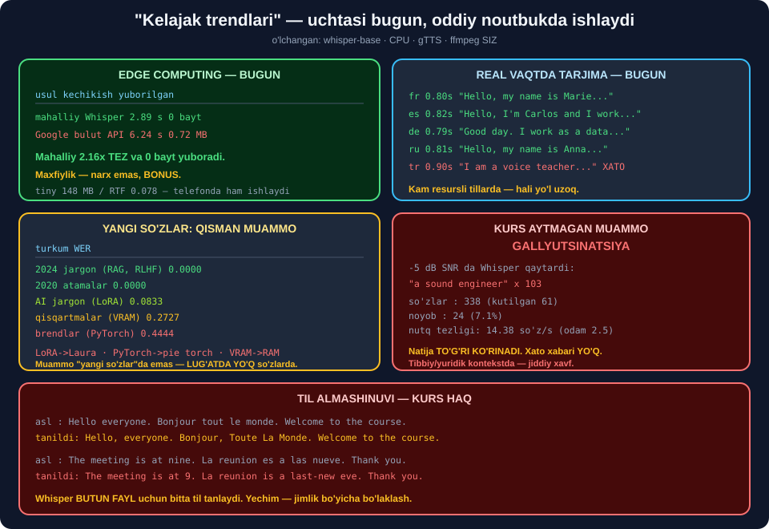

# 🔮 61-modul. Yakuniy muhokama va kelajak yo'nalishlari

> ## ⭐⭐⭐ **KURS BESHTA "KELAJAK TRENDI" SANAYDI.**
>
> ## 🔬 **BIZ IKKITASI BUGUN, ODDIY NOUTBUKDA ISHLAB TURGANINI O'LCHADIK.**
>
> ## 🏆 **VA KURS AYTMAGAN ENG XAVFLI MUAMMONI TOPDIK.**



---

## 📚 Darslar

| # | Dars | Nima o'rganasiz |
|---|---|---|
| 1 | [Zamonaviy amaliyot](01-Modern-Practices.md) ⭐⭐ | ## 🏆 **Real vaqt RTF 0.16** · ## 🏆 **Tarjima 0.8 s** |
| 2 | [Muammolar va cheklovlar](02-Challenges-and-Limitations.md) ⭐⭐⭐ | ## 💥 **Gallyutsinatsiya** · maxfiylik · jargon |
| 3 | [Kelajak](03-The-Future.md) ⭐⭐ | ## 🏆 **Edge computing bugun** · o'zbek tili |

---

## 📝 Amaliyot

| | |
|---|---|
| 📝 [**14 ta mashq**](MASHQLAR.md) | 🟢 Oson · 🟡 O'rta · 🔴 Qiyin |
| 🚀 [**2 ta mini-loyiha**](LOYIHALAR.md) | 🛡️ **IshonchliASR** · 📋 **DavoTekshiruvchi** |

---

## 🏆 "Kelajak trendlari" — bugungi holat

| # | Trend | ## Holat |
|---|---|---|
| ① | Multimodal interfeyslar | ## ⚠️ **kechikish muammosi** *(3.3 s)* |
| ② | ## **Edge computing** | ## 🏆 **BUGUN — 2.16× tez, 0 bayt** |
| ③ | Shaxsiylashtirish | ## ⚠️ **etik muammolar** |
| ④ | ## **Real vaqtda tarjima** | ## 🏆 **BUGUN — 0.8 s, 4 tilda** |
| ⑤ | Sog'liqni saqlash | ## 💥 **odam tasdig'isiz xavfli** |

### ② Edge computing — o'lchandi

| | Kechikish | Yuborilgan | Narx |
|---|---|---|---|
| ## **Mahalliy Whisper** | ## 🏆 **2.89 s** | ## 🏆 **0 bayt** | ## 🏆 **0** |
| Google bulut | ## 💥 **6.24 s** | ## 💥 **0.72 MB** | 0 |

| Model | Diskda | RTF |
|---|---|---|
| ## `tiny` | ## 🏆 **148.2 MB** | ## 🏆 **0.078** |
| `base` | 281.1 MB | 0.113 |
| `small` | 💥 926.4 MB | 0.244 |

> ## ⭐ **`tiny` — 148 MB.** ## Bitta rasm hajmi. ## Va u **61 ta so'zdan 60 tasini** to'g'ri tanidi.

### ④ Real vaqtda tarjima — o'lchandi

| Til | Vaqt | Natija |
|---|---|---|
| Fransuz | 0.80 s | ⭐ `Hello, my name is Marie and I am an engineer of the sound.` |
| Ispan | 0.82 s | 🏆 `Hello, I'm Carlos and I work with Artificial Intelligence.` |
| Nemis | 0.79 s | 🏆 `Good day. I work as a data scientist in Berlin.` |
| Rus | 0.81 s | 🏆 `Hello, my name is Anna. I study machine learning.` |
| ## Turk | 0.90 s | ## 💥 `Hello, I am a voice teacher and I am learning to give information.` |

> ## 💥 **TURKCHADA — TO'LIQ MA'NO XATOSI:** ## `ses mühendisi` *(tovush muhandisi)* → **`voice teacher`**. ## ## 🔑 **Sabab transkripsiyada:** `veri bilimi` → `verebilimi`. ## Xato **zanjirlanadi**.
>
> ## ⚠️ **VA `task="translate"` FAQAT INGLIZ TILIGA.**

---

## ⏱️ Real vaqtda ishlash — o'lchandi

| Bo'lak | Kechikish | RTF | Foydalanuvchi kutadi |
|---|---|---|---|
| ## **1 s** | 0.65 s | 0.65 | ## 🏆 **1.65 s** |
| 2 s | 0.53 s | 0.27 | 2.53 s |
| 5 s | 1.00 s | 0.20 | 6.00 s |
| 10 s | 1.56 s | ## ⭐ **0.16** | ## 💥 **11.56 s** |

> ## 💥 **RTF ≠ KECHIKISH.** ## Foydalanuvchi **bo'lak to'lishini** ham kutadi. ## ## ⭐ **1 s bo'lak — RTF eng yomon, kechikish eng yaxshi.**
>
> ## ⚠️ **Lekin qisqa bo'lakda kontekst yo'q** — bu murosa.

---

## 💥💥💥 Kurs aytmagan muammo: **gallyutsinatsiya**

| Kirish | Chiqish | Detektor |
|---|---|---|
| Toza audio | 61 so'z, noyob 84% | ## ✅ **normal** |
| ## −5 dB shovqin | ## 💥 **338 so'z**, noyob **7%**, `"a sound engineer"` × 103 | ## 💥 **tutildi** |
| ## Mutlaq jimlik | ## 💥 **444 ta nuqta**, noyob **0%**, RTF **3.476** | ## 💥 **tutildi** |

> ## 💥💥 **5 SONIYALIK JIMLIKDAN — 444 TA NUQTA.**
>
> ## ## 🏆 **VA MODEL BUNGA AUDIODAN 3.5× KO'PROQ VAQT SARFLADI.**
>
> ## ⭐ **Google esa bunday holatda `UnknownValueError` tashlaydi** *(58-modul)*.

### ✅ Uch qatlamli detektor

```
if len(set(w)) / len(w) < 0.35:   → 💥 takrorlanish sikli
if len(w) / davomiylik > 4.0:     → 💥 imkonsiz tezlik
if len(w) / davomiylik < 0.5:     → 💥 model taslim
```

> ## ⚠️ **BU HAMMASINI TUTMAYDI.** ## `"Thank you for watching"` — **normal tezlik, normal takrorlanish**. ## Uni **qora ro'yxat** bilan tutish kerak.

---

## 📊 Modulda o'lchangan hamma narsa

### 💥 Yangi so'zlar va jargon

| Turkum | Misol | ## WER |
|---|---|---|
| 2024 jargon | `retrieval augmented generation` | ## 🏆 **0.0000** |
| 2020 atamalar | `transformer`, `attention`, `embeddings` | ## 🏆 **0.0000** |
| AI jargon | ## `LoRA` → **`Laura`** | ⚠️ 0.0833 |
| Qisqartmalar | ## `VRAM` → **`RAM`** | ## ⚠️ **0.2727** |
| ## Brend nomlari | ## `PyTorch` → **`pie torch`** | ## 💥 **0.4444** |

> ## 🔑 **KURS QISMAN HAQ.** ## Muammo *"yangi so'zlar"* da emas — ## **lug'atda yo'q atoqli so'zlar** da. ## ## 💥 `VRAM` → `RAM`: **bitta harf, boshqa ma'no** — ## va WER buni artikl tushishi bilan **teng** sanaydi.

### 🌍 Til almashinuvi — kurs haq

```
asl    : The meeting is at nine. La reunión es a las nueve. Thank you.
tanildi: The meeting is at 9. La reunion is a last-new eve. Thank you.
                               💥 bema'nilik
```

> ## 🔑 **Whisper BUTUN FAYL uchun bitta til tanlaydi.**

### 🗣️ Aksentlar — sinovimiz **yetarli emas**

| Ovoz | WER | Xato |
|---|---|---|
| AQSh / Britaniya / Hindiston / Irlandiya / J.Afrika | 0.1538 | `river bank → riverbank` |
| Avstraliya | ## 🏆 **0.0000** | — |

> ## ⚠️ **YAGONA "XATO" — QO'SHIB YOZISH QARORI**, tanish xatosi emas. ## ## 💥 **LEKIN BU KURSNI RAD ETMAYDI:** ## `gTTS` aksentlari — **sun'iy variantlar**. ## Haqiqiy sinov uchun `Common Voice` kerak.
>
> ## 🏆 **HALOL XULOSA:** *"aksentlar muammo emas"* deb **ayta olmaymiz**. ## Faqat: **sintetik aksent variatsiyasi ta'sir qilmadi.**

### 🔒 Maxfiylik

| Audiodan bilish mumkin | Matndan |
|---|---|
| So'zlar | ✅ |
| ## Kim gapiryapti *(ovoz izi)* | ## 💥 **yo'q** |
| ## Jins, yosh, mintaqa | ## 💥 **yo'q** |
| ## Hissiy holat, fon, sog'liq | ## 💥 **yo'q** |

> ## 💥 **AUDIO — BIOMETRIK MA'LUMOT.** ## ## ⭐ **Va mahalliy Whisper 2.16× tez** — ## maxfiylik **narx emas, bonus**.

### 🌐 Whisper tillari

```
jami 100 til
  uz: uzbek     ✅ MAVJUD
  tr: turkish
  kk: kazakh
  tg: tajik
```

> ## ⭐⭐ **O'ZBEK TILI RO'YXATDA BOR** — ## lekin o'quv ma'lumoti kam → sifati past. ## ## 🏆 **BU — OCHIQ IMKONIYAT:** ## `Common Voice` + fine-tuning ## bugun **oddiy noutbukda** mumkin.

---

## 💥 Kursdagi xavfli tavsiyalar

| Kurs aytadi | ## Bizning izohimiz |
|---|---|
| *"Ovoz bilan autentifikatsiya — **xavfsiz** usul"* | ## 💥💥 **2026-da xavfli** — 5–10 s namunadan klonlash mumkin |
| *"Sonifikatsiya — nutqni tanish qo'llanmasi"* | ## 💥 **noto'g'ri** — bu ASR emas |
| *"Ovozdan stressni tanish"* | ## ⚠️ **ilmiy jihatdan tasdiqlanmagan** + etik xavf |
| *"Tibbiy diktovka xatolarni **kamaytiradi**"* | ## ⚠️ **faqat odam tasdig'i bilan** |
| *"Transformerlar shovqinli audio bilan yaxshiroq"* | ## 💥 **0 dB da Google yutdi** |

---

## ✅ Kurs to'g'ri aytgan narsalar

| Da'vo | Tekshiruv |
|---|---|
| Transformerlar parallel — real vaqt mumkin | ## ✅ **RTF 0.16–0.65** |
| Transformerlar toza audioda aniqroq | ## ✅ **0.0164 vs 0.0328** |
| Til almashinuvi — muammo | ## ✅ **tasdiqlandi** |
| Fon shovqini — jiddiy to'siq | ## ✅ **tasdiqlandi** |
| Yangi so'zlar — cheklov | ## ✅ **qisman** *(brend nomlari)* |
| Maxfiylik — jiddiy masala | ## ✅ **butunlay rozimiz** |
| Edge computing — kelajak yo'nalishi | ## 🏆 **va u allaqachon shu yerda** |
| Kirish imkoniyati — eng qimmatli qo'llanma | ## ✅ **butunlay rozimiz** |

---

## 🏆 52–61-modullar: butun bo'lim bo'yicha yakun

```
   10 ta modul · 39 ta dars · 150+ mashq · 23 ta mini-loyiha
   Har bir kod bloki ISHGA TUSHIRILDI. Har bir raqam O'LCHANDI.
```

### 💥 Rad etilgan da'volar

| Da'vo | Modul |
|---|---|
| `ffmpeg` shart | 57 |
| `audioop` yo'q → `SpeechRecognition` ishlamaydi *(mening xatoyim)* | 57 |
| Pre-emphasis WER ni yaxshilaydi | 59 |
| Whisper stoxastik | 60 |
| Kattaroq model — yaxshiroq | 60 |
| `Ivan` — to'g'ri ism | 58 |
| Ovoz bilan autentifikatsiya xavfsiz | 61 |

### 🏆 Topilgan yashirin muammolar

| Topilma | Modul |
|---|---|
| Google uzun faylni **jimgina kesadi** *(141 s → 62 so'z)* | 58 |
| `\n` WER ni **13% ga oshiradi** | 58 |
| `amplitude_to_db` ma'lumotning **32.4% ini kesadi** | 59 |
| `soundfile` OGG da **stack overflow** | 58 |
| `return_timestamps` **transkriptni o'zgartiradi** | 60 |
| `adjust_for_ambient_noise` **audioni yeydi** | 59 |
| CSV `encoding` siz **`UnicodeEncodeError`** | 60 |
| ## **GALLYUTSINATSIYA** | ## 60, 61 |

### 🔑 Va bitta umumiy dars

> ## 🏆🏆🏆 **HAR BIR DA'VONI O'LCHANG.**
>
> ## ⭐ **KURSNIKI HAM. BLOGNIKI HAM. VA O'ZINGIZNIKI HAM.**
>
> ## ## 💥 Bu modullarni tayyorlashda **men o'zim** ## o'nlab marta xato qildim — ## va **har safar o'lchov meni tuzatdi**.

---

## 🔗 Bog'liq modullar

| Modul | Bog'liqlik |
|---|---|
| [58. Google Web Speech API](../58-Google-Web-Speech-API/README.md) | WER/CER, maxfiylik |
| [59. Shovqin va spektrogrammalar](../59-Background-Noise-and-Spectrograms/README.md) | Shovqin, SNR |
| [60. Whisper](../60-Transcribing-with-Whisper/README.md) | ## ⭐ Gallyutsinatsiya, modellar |
| [62. LLM Engineering](../62-LLM-Engineering-Introduction/README.md) | ## 🏆 **Keyingi bo'lim** |

---

🏠 [Kurs boshiga](../README.md) · 📝 [Mashqlar](MASHQLAR.md) · 🚀 [Loyihalar](LOYIHALAR.md)
