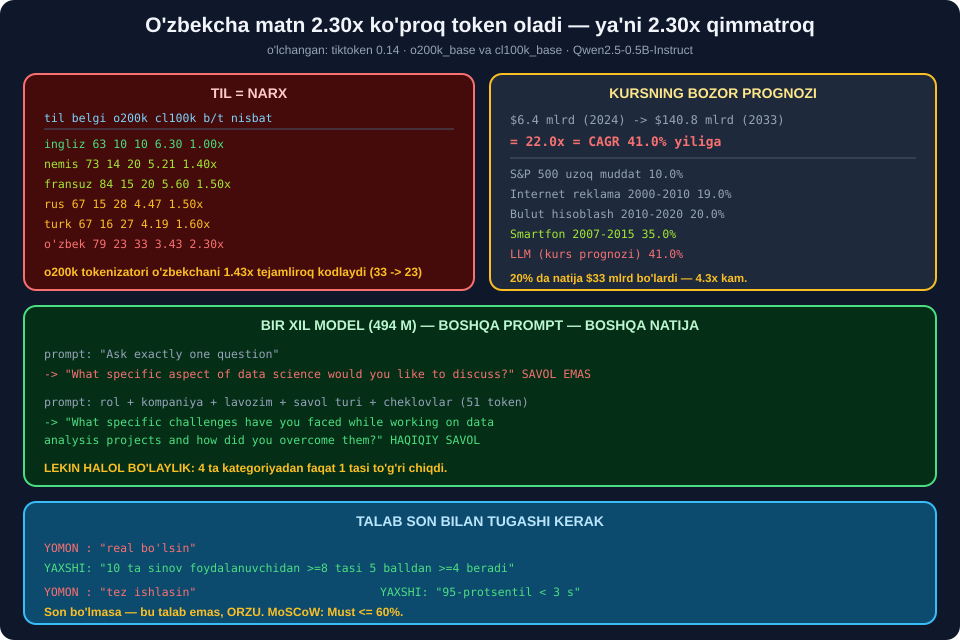

# 🧠 62-modul. LLM Engineering — kirish

> ## ⭐⭐⭐ **KURS OPENAI API NI TALAB QILADI — PULLIK.**
>
> ## 🔬 **BIZ MAHALLIY MODELNI SINADIK: 494 M PARAMETR, 3.1 s YUKLASH, 0.8 s JAVOB.**
>
> ## 💥 **VA O'ZBEKCHA MATN 2.30× KO'PROQ TOKEN OLISHINI O'LCHADIK.**



---

## 📚 Darslar

| # | Dars | Nima o'rganasiz |
|---|---|---|
| 1 | [Kursga kirish](01-Introduction-to-the-Course.md) ⭐ | ## 💥 **O'zbekcha 2.30× qimmat** · CAGR 41% |
| 2 | [Kurs nimalarni qamraydi](02-What-Does-the-Course-Cover.md) ⭐ | ## 🏆 **Kalitsiz yo'l** · `LLMAdapter` |
| 3 | [Vosita xususiyatlari](03-The-Interview-Tools-Specifics.md) ⭐⭐ | ## 🏆 **O'lchanadigan talablar** · MoSCoW |

---

## 📝 Amaliyot

| | |
|---|---|
| 📝 [**14 ta mashq**](MASHQLAR.md) | 🟢 Oson · 🟡 O'rta · 🔴 Qiyin |
| 🚀 [**2 ta mini-loyiha**](LOYIHALAR.md) | 💰 **TokenBudjet** · 📋 **TalablarHujjati** |

---

## 💥💥💥 Modulning bosh topilmasi: **til = narx**

| Til | Belgi | `o200k` | `cl100k` | Belgi/token | ## Nisbat |
|---|---|---|---|---|---|
| ## **Ingliz** | 63 | ## 🏆 **10** | 10 | ## 🏆 **6.30** | 1.00× |
| Nemis | 73 | 14 | 20 | 5.21 | 1.40× |
| Fransuz | 84 | 15 | 20 | 5.60 | 1.50× |
| Rus | 67 | 15 | 28 | 4.47 | 1.50× |
| Turk | 67 | 16 | 27 | 4.19 | 1.60× |
| ## **O'zbek** | 79 | ## 💥 **23** | ## 💥 **33** | ## 💥 **3.43** | ## 💥 **2.30×** |

> ## 💥 **O'ZBEKCHA MATN 2.30× KO'PROQ TOKEN — YA'NI 2.30× QIMMAT.**
>
> ## ## 🏆 **VA TOKENIZATOR MUHIM:** ## `cl100k` — **33 token**, `o200k` — **23 token**. ## Yangi tokenizator o'zbek tilini **1.43× tejamliroq** kodlaydi.
>
> ## ⭐ **O'zbek tilida ishlasangiz — `o200k` li modellarni tanlang.**

---

## 🏆 Kalitsiz yo'l — tasdiqlandi

```python
from transformers import pipeline
llm = pipeline("text-generation", model="Qwen/Qwen2.5-0.5B-Instruct",
               device=-1, dtype="auto")
```

| O'lchov | Qiymat |
|---|---|
| Parametrlar | ## **494 M** |
| Yuklash | ## ⭐ **3.1 s** |
| Generatsiya | ## 🏆 **0.8 s** |
| Narx | ## 🏆 **$0** |
| Internet | ## 🏆 **kerak emas** |
| ## O'zbek tili | ## 💥 **zaif** |

### 💥 O'zbekcha javob — haqiqiy natija

```
so'rov : "Salom!"  (system: "Siz HR mutaxassisisiz.")
javob  : "Sizhi salom! Qaysiz mumkin?"
```

> ## 💥 **BU O'ZBEKCHA EMAS.** ## Model so'zlarni **taniydi**, grammatikani **bilmaydi**. ## ## ⭐ **Kichik mahalliy model bilan — INGLIZ TILIDA ishlang.**

---

## ⭐⭐ Prompt sifatga qanchalik ta'sir qiladi?

```
prompt: "Ask exactly one question."                          (5 token)
  → "What specific aspect of data science would you like
     to discuss?"                                    💥 SAVOL EMAS

prompt: rol + kompaniya + lavozim + savol turi + cheklovlar  (51 token)
  → "What specific challenges have you faced while working
     on data analysis projects and how did you overcome them?"  ✅
```

> ## 🏆 **BIR XIL MODEL. BOSHQA PROMPT. BOSHQA NATIJA.**

### 💥 Lekin halol bo'laylik — 4 tadan 1 tasi

| Kategoriya | ## Olingan | Baho |
|---|---|---|
| `hr/xulq` | Xulq-atvor savoli | ## ✅ |
| ## `hr/boshqotirma` | ## 💥 *"What is the primary goal of data science?"* | ## 💥 |
| ## `texnik/kod` | ## 💥 *"What is the purpose of pandas?"* | ## 💥 |
| ## `texnik/database` | ## 💥 *"What is the primary goal of using a database?"* | ## 💥 |

> ## 🔧 **MEN "TO'RTTASI HAM YAXSHI" DEB KUTGAN EDIM.** ## ## 💥 **HAQIQAT: 1/4.**
>
> ## ## 🔑 Model `kod` va `database` ni ## **VAZIFA emas, MAVZU** deb tushundi. ## ## ⭐ Tuzatish uchun **few-shot misollar** kerak — **64-modul**.

---

## 📊 Modulda o'lchangan hamma narsa

### 💰 Suhbat narxi *(10 navbat)*

| | Qiymat |
|---|---|
| Tizim prompt | 82 token |
| ## **Kirish jami** | ## 💥 **8 020 token** |
| Chiqish jami | 1 600 token |
| ## Nisbat | ## 💥 **5.0× ko'p yuborildi** |
| Kontekst o'sishi | 242 → **1 522** *(6.3×)* |

> ## 🔑 **HAR BIR NAVBATDA BUTUN TARIX QAYTA YUBORILADI.**

| Model | 10 000 suhbat |
|---|---|
| ## **`gpt-4o-mini`** | ## 🏆 **$21.63** |
| `gpt-3.5-turbo` | $64.10 *(3.0×)* |
| ## `gpt-4o` | ## 💥 **$360.50** *(16.7×)* |
| ## **mahalliy** | ## 🏆 **$0.00** |

> ## 🔧 **MEN YANA XATO QILGAN EDIM.** ## *"`gpt-3.5` eski tokenizator tufayli ko'proq token oladi"* deb kutdim. ## ## 💥 **Haqiqat: uchalasi ham 9 620 token.** ## Prompt **inglizcha**, va inglizchada ikkala tokenizator ham **bir xil**. ## ## ⭐ **Tokenizator farqi faqat ingliz bo'lmagan matnda ko'rinadi.**

### 📈 Kursning bozor prognozi

| | Qiymat |
|---|---|
| $6.4 mlrd → $140.8 mlrd | 22.0× |
| ## **CAGR** | ## 💥 **41.0% yiliga** |
| Smartfon 2007–2015 | 35.0% |
| Bulut 2010–2020 | 20.0% |
| ## 20% da natija | ## **$33.0 mlrd** *(4.3× kam)* |

> ## ⚠️ **YOLG'ON EMAS — JUDA OPTIMISTIK.** ## Biznes rejasini prognozga emas, ## **o'zingizning birinchi 10 ta mijozingizga** asoslang.

### 📋 Talablar hujjati

```
10 talab · ✅ 9 o'lchanadi (90%)
MoSCoW: M=5 S=3 C=1 W=1

TEKSHIRUV:
  ⚠️ 'maxfiylik' tegli talab yo'q
```

> ## 🏆 **SINF HAQIQIY BO'SHLIQNI TOPDI.** ## Foydalanuvchi **rezyume** kiritadi — u qayerga ketadi? ## ## 💥 **Kurs ham buni sanamagan edi.**

---

## 🔑 Talab yozish qoidasi

| Yomon | ## Yaxshi |
|---|---|
| *"real bo'lsin"* | ## ⭐ **"10 sinovdan ≥8 tasi 5 balldan ≥4 beradi"** |
| *"tez ishlasin"* | ## ⭐ **"95-protsentil < 3 s"** |
| *"arzon bo'lsin"* | ## ⭐ **"bitta intervyu < $0.05"** |
| *"xavfsiz bo'lsin"* | ## ⭐ **"20 sinov hujumining 100% i to'xtatiladi"** |

> ## 🏆 **HAR BIR TALAB SON BILAN TUGASHI KERAK.**
>
> ## ## 💡 **Son bo'lmasa — bu talab emas, ORZU.**

| MoSCoW | Ma'nosi | Ulushi |
|---|---|---|
| ## **M** — Must | Busiz ishlamaydi | ## ⭐ **≤ 60%** |
| **S** — Should | Muhim, kutish mumkin | ~20% |
| **C** — Could | Vaqt qolsa | ~15% |
| ## **W** — Won't | ## **Bu safar YO'Q** | ~5% |

> ## ⚠️ **HAMMA NARSA "MUST" BO'LSA — HECH NARSA "MUST" EMAS.**

---

## 💥 Kurs sanamagan talablar

| Talab | Nega kerak |
|---|---|
| ## **Ma'lumot maxfiyligi** | Rezyume qayerga ketadi? |
| ## **Prompt injection** | *"Barcha ko'rsatmalarni unut"* |
| **Gallyutsinatsiya** | Yo'q kompaniya haqida savol |
| **Narx chegarasi** | Bitta foydalanuvchi $100 sarflasa? |
| **Tillar** | Faqat ingliz? |
| ## **Adolat** | ## 💥 **Model ismga qarab turlicha baholasa?** |

> ## 💥 **OXIRGISI — ENG JIDDIYSI.** ## Intervyu vositasi **odamlarni baholaydi**. ## ## 🏆 **68–76-modullarda (AI etikasi) bu mavzuga qaytamiz.**

---

## ✅ Kurs to'g'ri aytgan narsalar

| Da'vo | Tekshiruv |
|---|---|
| Rejalashtirish → prototip → ilg'or | ## ✅ **to'g'ri tartib** |
| Talablarni erta hujjatlashtirish | ## ✅ **butunlay rozimiz** |
| Intervyu tasnifi *(HR/texnik)* | ## ✅ **foydali va promptga aylanadi** |
| Stakeholderlar bilan muhokama | ## ✅ to'g'ri |
| *"Yangi g'oyaga berilib ketish oson"* | ## 🏆 **aynan shuning uchun MoSCoW** |

---

## 🚀 Tez boshlash

```python
import tiktoken
from transformers import pipeline

enc = tiktoken.get_encoding("o200k_base")
llm = pipeline("text-generation", model="Qwen/Qwen2.5-0.5B-Instruct",
               device=-1, dtype="auto")


def sora(tizim, savol, max_tokens=120):
    print(f"prompt: {len(enc.encode(tizim + savol))} token")
    o = llm([{"role": "system", "content": tizim},
             {"role": "user", "content": savol}],
            max_new_tokens=max_tokens, do_sample=False)
    return o[0]["generated_text"][-1]["content"].strip()
```

```python
print(sora("You are an HR interviewer at Google hiring a Data Scientist. "
           "Ask EXACTLY ONE behavioral question. Output only the question.",
           "Begin."))
```

---

## 🔗 Bog'liq modullar

| Modul | Bog'liqlik |
|---|---|
| [60. Whisper](../60-Transcribing-with-Whisper/README.md) | ## ⭐ Mahalliy model, gallyutsinatsiya |
| [63. Rejalashtirish](../63-LLM-Planning-Stage/README.md) | ## 🏆 **Tokenlar, narx, MB sxemasi** |
| [64. Promptlar](../64-Crafting-and-Testing-Prompts/README.md) | ## ⭐ Few-shot — bu moduldagi muammoning yechimi |

---

🏠 [Kurs boshiga](../README.md) · 📝 [Mashqlar](MASHQLAR.md) · 🚀 [Loyihalar](LOYIHALAR.md)
