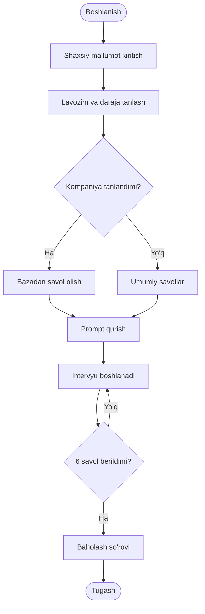
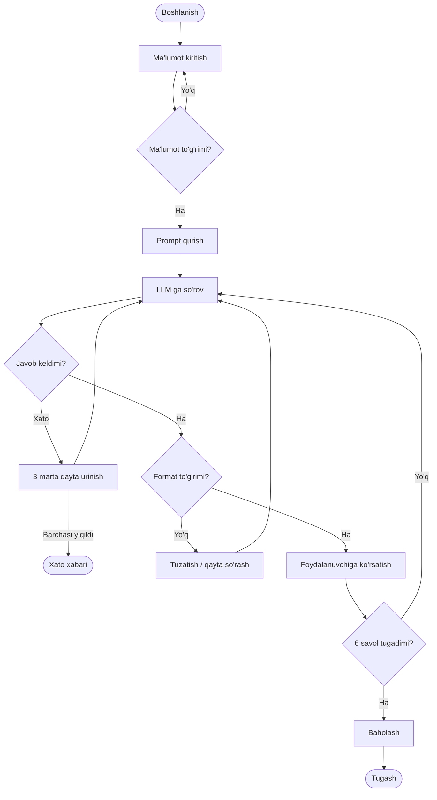

# 8-dars. Faoliyat diagrammasi nima? ⭐

## 🎬 Boshlashdan oldin

> **"Kurs diagrammani rasm sifatida chizadi. Biz uni MATN sifatida yozamiz — chunki matn `git diff` da ko'rinadi, rasm esa yo'q."**

---

## 1. Faoliyat diagrammasi nima?

**Faoliyat diagrammasi** *(activity diagram)* — UML notatsiyasi, tizimdagi **jarayon oqimini** ko'rsatadi.

| Element | Shakl | Ma'nosi |
|---|---|---|
| **Boshlanish** | ● to'ldirilgan doira | Jarayon boshlanadi |
| **Faoliyat** | ▭ yumaloq to'rtburchak | Bajariladigan qadam |
| ## **Qaror** | ## ◆ **romb** | ## Shartga qarab **shoxlanish** |
| **Birlashish** | ◆ romb | Shoxlar **qo'shiladi** |
| **O'tish** | → strelka | Keyingi qadam |
| **Tugash** | ◉ halqali doira | Jarayon tugadi |

> ## ✅ **KURS BULARNI TO'G'RI SANAYDI.**

---

## 2. ⚠️ Lekin kurs **rasm** chizadi — biz **matn** yozamiz

| | Rasm *(PNG/Figma)* | ## Matn *(Mermaid/PlantUML)* |
|---|---|---|
| `git diff` da ko'rinadi | ## 💥 **yo'q** | ## ✅ **ha** |
| Kod bilan birga versiyalanadi | ## 💥 **qiyin** | ## ✅ **oson** |
| Qidirish mumkin | ## 💥 **yo'q** | ## ✅ **ha** |
| Avtomatik generatsiya | ## 💥 **yo'q** | ## ✅ **ha** |
| Chiroyli | ## ⭐ **ha** | ⚠️ oddiy |
| GitHub'da ko'rinadi | ✅ | ## ✅ **Mermaid — avtomatik** |

> ## 🏆 **VA MANA ASOSIY SABAB:** ## ## 💥 **Rasm eskiradi va hech kim buni sezmaydi.** ## ## ⭐ **Matn eskirsa — `git blame` aytadi.**

---

## 3. 🔬 Mermaid — GitHub o'zi chizadi

````markdown

````

Va GitHub uni **avtomatik** chizadi:



| Sintaksis | Ma'nosi |
|---|---|
| `A([matn])` | ## ● **Boshlanish/tugash** |
| `B[matn]` | ▭ Faoliyat |
| `C{matn}` | ## ◆ **Qaror** |
| `-->` | → O'tish |
| `-->|yorliq|` | Yorliqli o'tish |

---

## 4. ⭐⭐ Diagramma **nima uchun** kerak?

| Foyda | Izoh |
|---|---|
| ## **Bo'shliqni ko'rsatadi** | *"Kompaniya tanlanmasa nima bo'ladi?"* |
| **Umumiy til** | Dasturchi + dizayner + biznes |
| ## **Test rejasi** | ## Har bir **yo'l** — bitta test |
| Hujjat | Yangi odam tez tushunadi |

### 🔬 Yo'llarni sanaymiz

Yuqoridagi diagrammada nechta **turli yo'l** bor?

```python
def yollarni_sana(qirralar, boshi, oxiri, max_tsikl=1):
    """Grafdagi barcha yo'llarni sanaydi (tsikllarni cheklab)."""
    yollar = []

    def yur(tugun, yol, tashrif):
        if tugun == oxiri:
            yollar.append(yol[:])
            return
        for keyingi in qirralar.get(tugun, []):
            if tashrif.get(keyingi, 0) >= max_tsikl:
                continue                      # ⚠️ tsiklni cheklaymiz
            tashrif[keyingi] = tashrif.get(keyingi, 0) + 1
            yur(keyingi, yol + [keyingi], tashrif)
            tashrif[keyingi] -= 1

    yur(boshi, [boshi], {boshi: 1})
    return yollar
```

```python
QIRRALAR = {
    "A": ["B"], "B": ["C"], "C": ["D"],
    "D": ["E", "F"],                       # ⭐ qaror
    "E": ["G"], "F": ["G"], "G": ["H"],
    "H": ["I"],
    "I": ["H", "J"],                       # ⭐ tsikl
    "J": ["K"], "K": [],
}
for m in [1, 2, 3]:
    y = yollarni_sana(QIRRALAR, "A", "K", max_tsikl=m)
    print(f"max_tsikl={m}: {len(y)} yo'l")
    for pth in y:
        print("   " + " -> ".join(pth))
```

### ✅ Haqiqiy natija

```
max_tsikl=1: 2 yo'l
   A -> B -> C -> D -> E -> G -> H -> I -> J -> K
   A -> B -> C -> D -> F -> G -> H -> I -> J -> K
max_tsikl=2: 4 yo'l
   A -> B -> C -> D -> E -> G -> H -> I -> H -> I -> J -> K
   A -> B -> C -> D -> E -> G -> H -> I -> J -> K
   A -> B -> C -> D -> F -> G -> H -> I -> H -> I -> J -> K
   A -> B -> C -> D -> F -> G -> H -> I -> J -> K
max_tsikl=3: 6 yo'l
   ... (har bir daraja +2 yo'l)
```

> ## 🔧 **BU YERDA MEN XATO QILDIM.** ## `max_tsikl=1` ni *"tsikl bir marta aylanadi"* deb ## o'ylagan edim va **4 ta yo'l** kutgandim.
>
> ## ## 💥 **HAQIQAT: `max_tsikl=1` = "har bir tugunga BIR MARTA kirish"** ## → tsikl **umuman aylanmaydi** → **2 ta yo'l**.
>
> ## ## ⭐ **Tsikl bir marta aylanishi uchun `max_tsikl=2` kerak.**

| `max_tsikl` | Yo'llar | Ma'nosi |
|---|---|---|
| 1 | ## **2** | Tsikl **aylanmaydi** |
| ## **2** | ## ⭐ **4** | Tsikl **1 marta** aylanadi |
| 3 | 6 | Tsikl **2 marta** aylanadi |

> ## 🏆 **AMALIY QOIDA — `max_tsikl=2` YETARLI:** ## ① tsiklsiz yo'l · ② tsikl bilan yo'l. ## ## 🔑 **Va bu — 4 ta test.**
>
> ## ## ⭐ **DIAGRAMMANING ENG AMALIY FOYDASI SHU:** ## u sizga **test rejasini** beradi.

> ## 💡 **VA E'TIBOR BERING — HAR BIR DARAJA +2 YO'L.** ## Ya'ni tsikli bor diagrammada ## yo'llar soni **cheksiz**. ## Shuning uchun **chegara qo'yish shart**.

---

## 5. 💥 Kurs ko'rsatmagan elementlar

| Element | Nega kerak |
|---|---|
| ## **Xato yo'li** | API ishlamasa nima bo'ladi? |
| ## **Bekor qilish** | Foydalanuvchi yopib ketsa? |
| **Parallel oqim** | Bir vaqtda bir nechta ish |
| ## **Vaqt chegarasi** | Model 30 s javob bermasa? |
| **Saqlash nuqtalari** | Qaysi bosqichda ma'lumot yoziladi? |

### ⭐ Xato yo'li bilan to'ldirilgan diagramma



> ## 💥 **E'TIBOR BERING — XATO YO'LLARI ASOSIY YO'LDAN KO'PROQ JOY OLDI.**
>
> ## ## 🔑 **VA BU — NORMAL.** ## Ishlab chiqarish kodining **yarmi** — xatolarni qayta ishlash.

---

## 🎯 Nazorat savollari

1. Faoliyat diagrammasining beshta asosiy elementi qaysi?
2. Nega rasm emas, matn afzal?
3. Bizning diagrammada nechta yo'l bor?
4. Yo'llar soni nima uchun muhim?
5. Kurs qaysi elementlarni ko'rsatmagan?

<details>
<summary>Javoblar</summary>

1. **Boshlanish** (●), **faoliyat** (▭), **qaror** (◆), **o'tish** (→), **tugash** (◉).
2. Matn **`git diff` da ko'rinadi**, kod bilan birga versiyalanadi, qidiriladi, avtomatik generatsiya qilinadi. ## **Rasm eskiradi va hech kim buni sezmaydi.**
3. ## **`max_tsikl=2` bilan — 4 ta.** Qaror nuqtasi `D` ikkiga bo'ladi, tsikl `H→I→H` yana ikkiga. ⚠️ **`max_tsikl=1` bilan esa faqat 2 ta** — men bu yerda xato qilib, `1` ni *"tsikl bir marta aylanadi"* deb o'ylagan edim.
4. Chunki **har bir yo'l — bitta test**. Diagramma sizga **test rejasini** beradi.
5. ## **Xato yo'li, bekor qilish, parallel oqim, vaqt chegarasi, saqlash nuqtalari.** To'liq diagrammada xato yo'llari **asosiy yo'ldan ko'proq** joy oladi — va bu **normal**.

</details>

---

⬅️ [7-dars](07-Database-Design.md) · 🏠 [Modul](README.md) · ➡️ [9-dars](09-Creating-an-Activity-Diagram.md)
