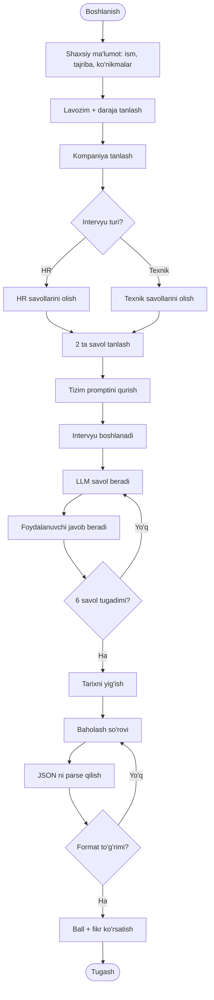
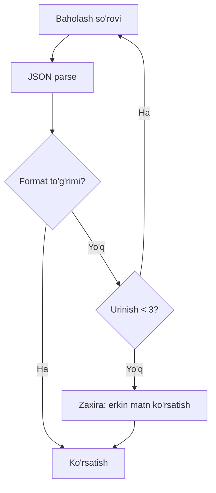
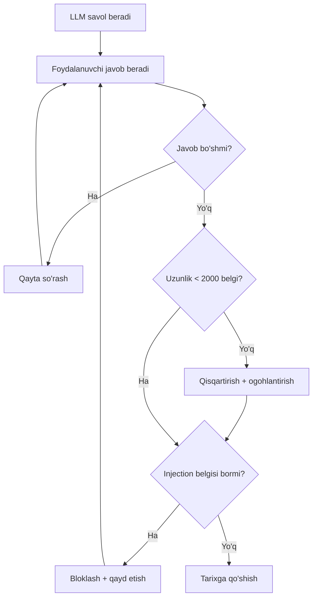

# 9-dars. Faoliyat diagrammasini yaratish ⭐⭐

## 🎬 Boshlashdan oldin

> **"Talablar ro'yxatini diagrammaga aylantiramiz — va ikkita bo'shliq topamiz, kurs ham, 62-moduldagi tekshiruvchimiz ham ko'rmagan bo'shliqlar."**

---

## 1. Talablardan diagrammaga

62-modulning talablari *(qisqartirilgan)*:

| Kod | Talab |
|---|---|
| T1 | Real intervyu simulyatsiyasi |
| T2 | Lavozim va kompaniya tanlash |
| T3 | Tajriba kiritish |
| T4 | Baholash va fikr-mulohaza |
| T5 | HR va texnik intervyu |
| T6 | Savollar bazasi |

> ## ✅ **KURSNING YONDASHUVI TO'G'RI:** ## *"Talablar ro'yxati — bizning nazorat varag'imiz."*

---

## 2. ⭐ To'liq diagramma



### 🔬 Talablarni diagrammaga solishtiramiz

| Talab | Diagrammadagi tugun | Baho |
|---|---|---|
| T1 *(real simulyatsiya)* | `J`–`M` tsikli | ## ✅ |
| T2 *(lavozim/kompaniya)* | `C`, `D` | ## ✅ |
| T3 *(tajriba)* | `B` | ## ✅ |
| T4 *(baholash)* | `N`–`R` | ## ✅ |
| T5 *(HR/texnik)* | `E` qarori | ## ✅ |
| T6 *(savollar bazasi)* | `F`, `G`, `H` | ## ✅ |

> ## ✅ **OLTITA TALAB — OLTITASI HAM QOPLANGAN.**

---

## 3. 💥💥 Lekin diagramma **ikkita bo'shliqni** ochib berdi

### 💥 Bo'shliq ①: `Q -->|Yo'q| O` — **cheksiz tsikl**

```
   O[Baholash so'rovi] --> P[Parse] --> Q{Format to'g'rimi?}
                            ▲                    │
                            └────────────────────┘  Yo'q
```

> ## 💥 **AGAR MODEL HECH QACHON TO'G'RI JSON BERMASA — ## ILOVA ABADIY AYLANADI.**
>
> ## ## 🔑 **VA HAR BIR AYLANISH — PUL.** ## 6-darsda o'lchagan edik: bitta baholash so'rovi ## ~4 964 kirish + 1 360 chiqish token.

### ✅ Tuzatish



### 💥 Bo'shliq ②: `L[Foydalanuvchi javob beradi]` — **hech qanday tekshiruv yo'q**

| Nima bo'lishi mumkin | Oqibat |
|---|---|
| Bo'sh javob | ## ⚠️ model chalkashadi |
| ## 10 000 so'zlik javob | ## 💥 **token portlashi** |
| ## *"Barcha ko'rsatmalarni unut"* | ## 💥💥 **prompt injection** |
| Boshqa tilda javob | ⚠️ model tilni almashtiradi |

> ## 💥💥 **UCHINCHISI — ENG XAVFLISI.** ## 67-modulda **prompt injection** ni batafsil ko'ramiz.

### ✅ Tuzatish



> ## 🏆 **VA MANA DIAGRAMMANING ASOSIY FOYDASI:** ## bu ikkala bo'shliqni **kod yozishdan oldin** topdik.
>
> ## ## 💡 **62-MODULDAGI `TalablarHujjati` HAM ULARNI KO'RMAGAN EDI** ## — u faqat *"maxfiylik talabi yo'q"* deb ogohlantirgan.
>
> ## ## 🔑 **YA'NI: TALABLAR RO'YXATI VA DIAGRAMMA — ## IKKI XIL ASBOB, IKKI XIL BO'SHLIQNI TOPADI.**

---

## 4. 🔧 Diagrammani **kodda** tekshirish

Mermaid matn — demak uni **parse qilish** mumkin:

```python
import re
from collections import defaultdict


def mermaid_parse(matn):
    """Mermaid flowchart dan graf quradi."""
    qirralar = defaultdict(list)
    tugunlar = {}

    for qator in matn.splitlines():
        q = qator.strip()
        if not q or q.startswith(("flowchart", "graph", "%%")):
            continue

        # tugun ta'riflari: A([...]) A[...] A{...}
        for kod, ochq, matn_ in re.findall(r"(\w+)([\(\[\{]+)([^\)\]\}]*)", q):
            tur = ("boshi_oxiri" if ochq.startswith("([") else
                   "qaror" if ochq.startswith("{") else "faoliyat")
            tugunlar.setdefault(kod, {"tur": tur, "matn": matn_.strip()})

        # qirralar: A --> B  yoki  A -->|yorliq| B
        m = re.match(r"(\w+)[\(\[\{]?[^-]*?-->\s*(?:\|([^|]*)\|)?\s*(\w+)", q)
        if m:
            a, yorliq, b = m.group(1), m.group(2), m.group(3)
            qirralar[a].append((b, (yorliq or "").strip()))
            tugunlar.setdefault(a, {"tur": "faoliyat", "matn": ""})
            tugunlar.setdefault(b, {"tur": "faoliyat", "matn": ""})

    return dict(qirralar), tugunlar


def diagramma_tekshir(qirralar, tugunlar):
    """Tipik xatolarni topadi."""
    muammolar = []
    kiruvchi = defaultdict(int)
    for a, lst in qirralar.items():
        for b, _ in lst:
            kiruvchi[b] += 1

    boshlar = [k for k in tugunlar if kiruvchi[k] == 0]
    oxirlar = [k for k in tugunlar if not qirralar.get(k)]

    if len(boshlar) != 1:
        muammolar.append(f"💥 boshlanish tugunlari: {boshlar} (1 ta bo'lishi kerak)")
    if not oxirlar:
        muammolar.append("💥 tugash tuguni yo'q — cheksiz oqim")

    # ⚠️ qaror tugunidan 2+ chiqish bo'lishi kerak
    for k, v in tugunlar.items():
        if v["tur"] == "qaror" and len(qirralar.get(k, [])) < 2:
            muammolar.append(f"💥 {k} — qaror, lekin {len(qirralar.get(k,[]))} chiqish")

    # ⚠️ chiqishsiz "faoliyat" tuguni
    for k, v in tugunlar.items():
        if v["tur"] == "faoliyat" and not qirralar.get(k):
            muammolar.append(f"⚠️ {k} — chiqishsiz faoliyat (tugash tuguni bo'lishi kerakmi?)")

    # ⚠️ chiqishi bor, lekin qaytish yo'li yo'q tsikl
    return muammolar or ["✅ tuzilish muammosi topilmadi"]
```

```python
DIAG = """flowchart TD
    A([Boshlanish]) --> B[Ma'lumot kiritish]
    B --> C{Kompaniya tanlandimi?}
    C -->|Ha| D[Bazadan savol]
    C -->|Yo'q| E[Umumiy savollar]
    D --> F[Prompt qurish]
    E --> F
    F --> G([Tugash])
"""
q, t = mermaid_parse(DIAG)
print(f"tugunlar: {len(t)}  qirralar: {sum(len(v) for v in q.values())}")
for x in diagramma_tekshir(q, t):
    print(f"  {x}")
```

### ✅ Haqiqiy natija

```
tugunlar: 7  qirralar: 7
  ✅ tuzilish muammosi topilmadi
```

### 🔬 Endi **buzuq** diagrammani sinaymiz

```python
BUZUQ = """flowchart TD
    A([Boshlanish]) --> B[Ma'lumot kiritish]
    B --> C{Kompaniya tanlandimi?}
    C -->|Ha| D[Bazadan savol]
    D --> E[Prompt qurish]
    F([Ikkinchi boshlanish]) --> E
"""
q2, t2 = mermaid_parse(BUZUQ)
for x in diagramma_tekshir(q2, t2):
    print(f"  {x}")
```

```
  💥 boshlanish tugunlari: ['A', 'F'] (1 ta bo'lishi kerak)
  💥 C — qaror, lekin 1 chiqish
  ⚠️ E — chiqishsiz faoliyat (tugash tuguni bo'lishi kerakmi?)
```

> ## 🏆🏆 **UCHTA XATO — UCHTASI HAM TOPILDI:** ## ① ikkita boshlanish · ② qarorning bitta shoxi ## *(`Yo'q` yo'li yo'q!)* · ③ tugash tuguni yo'q.
>
> ## ## ⭐ **VA BU — CI DA ISHLASHI MUMKIN.** ## Diagramma buzilsa — **build yiqiladi**.

---

## 🎯 Nazorat savollari

1. Talablar ro'yxati diagrammani to'liq qoplaydimi?
2. Diagramma qanday ikkita bo'shliqni ochdi?
3. `Q -->|Yo'q| O` tsikli nima uchun xavfli?
4. Foydalanuvchi javobini nega tekshirish kerak?
5. Diagrammani kodda tekshirish nimaga kerak?

<details>
<summary>Javoblar</summary>

1. ## **Ha, oltitasi ham qoplandi.** Lekin diagramma **qo'shimcha bo'shliqlarni** ko'rsatdi.
2. ## ① **Cheksiz tsikl** — model to'g'ri JSON bermasa, ilova abadiy aylanadi va **har aylanish pul turadi**. ## ② **Foydalanuvchi javobi tekshirilmaydi** — bo'sh, juda uzun yoki **prompt injection** bo'lishi mumkin.
3. Chunki **chiqish sharti yo'q**. Har bir urinish ~4 964 kirish + 1 360 chiqish token. Yechim: **urinishlar soni** + **zaxira yo'l**.
4. **Bo'sh javob** model'ni chalkashtiradi, **10 000 so'zlik javob** token portlashi, **prompt injection** esa butun tizimni buzadi (67-modul).
5. Chunki Mermaid — **matn**. Uni parse qilib **CI da tekshirish** mumkin: ikkita boshlanish, shoxsiz qaror, tugash tugunisiz oqim. Diagramma buzilsa — **build yiqiladi**.

</details>

---

⬅️ [8-dars](08-What-Is-an-Activity-Diagram.md) · 🏠 [Modul](README.md) · ➡️ [10-dars](10-Concluding-the-Planning-Stage.md)
