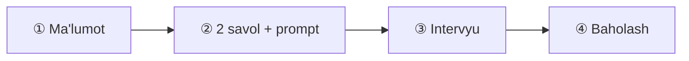

# 10-dars. Rejalashtirish bosqichini yakunlash ⭐

## 🎬 Boshlashdan oldin

> **"Rejalashtirish tugadi. Endi butun rejani BITTA hisobotga yig'amiz — va u oldindan aytadi: oyiga $14.05, teng nuqta 230 681 suhbat/kun, 4 ta test yo'li."**

---

## 1. Kursning yakuniy oqimi

> ## 🔑 **KURS AYTADI:** ## *"① Foydalanuvchi ma'lumotini yig'amiz. ## ② Bazadan **ikkita** savol olib prompt quramiz. ## ③ GPT-4 bilan intervyu o'tkazamiz. ## ④ Suhbat tarixini olib, **boshqa prompt** bilan ball chiqaramiz."*



> ## ✅ **TO'RTTA BOSQICH — TO'G'RI TUZILISH.**
>
> ## ⭐ **VA ④ — "BOSHQA PROMPT"** — ## bu **to'g'ri tanlov** *(6-dars: atigi 14.2% qimmat, ancha ishonchli)*.

---

## 2. 📊 Butun rejalashtirish — bitta jadvalda

| Savol | Javob | Qayerda o'lchandi |
|---|---|---|
| Hosting yoki API? | ## ⭐ **API** *(< 1.7 so'rov/s)* | 1-dars |
| Ochiq yoki yopiq? | ## ⭐ **API** *(ingliz)*, mahalliy *(nozik)* | 2-dars |
| Qaysi model? | ## ⭐ **`gpt-4o-mini`** | 4-dars |
| Prompt uzunligi? | ## **138–212 token** | 5-dars |
| Baholash qanday? | ## ⭐ **Ikkinchi so'rov + JSON** | 6-dars |
| Ma'lumotlar bazasi? | ## **6 jadval, 2 ta N:M** | 7-dars |
| Nechta test kerak? | ## ⭐ **4 ta yo'l** | 8-dars |
| Qanday bo'shliqlar bor? | ## 💥 **cheksiz tsikl, tekshiruvsiz kirish** | 9-dars |

### 💰 Va narx

| Model | 10 000 suhbat *(6 navbat + baholash)* |
|---|---|
| ## **`gpt-4o-mini`** | ## 🏆 **$15.61** |
| `gpt-3.5-turbo` | $45.22 *(2.9×)* |
| ## `gpt-4o` | ## 💥 **$260.10** *(16.7×)* |
| ## **Mahalliy** | ## 🏆 **$0.00** |

> ## 🏆 **VA BU HAMMASI — BITTA QATOR KOD YOZILMASDAN OLDIN.**

---

## 3. 🔧 Reja hisoboti — bitta funksiya

```python
import json, math


def reja_hisoboti(nom, tizim_tok, navbatlar, foydalanuvchi_kuniga,
                  model="gpt-4o-mini", baho_tok=400, testlar=4):
    """Butun rejalashtirish natijasini bitta hisobotga yig'adi."""
    NARX = {"gpt-4o-mini": (0.150, 0.600), "gpt-4o": (2.500, 10.00),
            "gpt-3.5-turbo": (0.500, 1.500), "mahalliy": (0.0, 0.0)}
    ki, ch = NARX[model]

    # --- bitta suhbat ---
    kirish, tarix = 0, tizim_tok
    for _ in range(navbatlar):
        kirish += tarix
        tarix += 40 + 120
    chiqish = navbatlar * 160
    kirish += tarix + 120          # baholash so'rovi
    chiqish += baho_tok

    narx_1 = (kirish * ki + chiqish * ch) / 1e6
    kunlik = narx_1 * foydalanuvchi_kuniga
    oylik = kunlik * 30

    # --- hosting bilan taqqoslash (1-dars) ---
    HOSTING_HAFTA = 2.50 * 6 * 24 * 7        # 6 × A100 (2-darsda tuzatilgan)
    teng_sorov_hafta = HOSTING_HAFTA / narx_1 if narx_1 else float("inf")

    d = {
        "loyiha": nom, "model": model,
        "bitta_suhbat": {"kirish_tok": kirish, "chiqish_tok": chiqish,
                         "narx_usd": round(narx_1, 6)},
        "kunlik_usd": round(kunlik, 2),
        "oylik_usd": round(oylik, 2),
        "yillik_usd": round(oylik * 12, 2),
        "hosting_hafta_usd": round(HOSTING_HAFTA, 2),
        "teng_nuqta_sorov_kuniga": (round(teng_sorov_hafta / 7)
                                    if math.isfinite(teng_sorov_hafta) else None),
        "testlar": testlar,
    }
    d["tavsiya"] = ("hosting" if (d["teng_nuqta_sorov_kuniga"] or 1e18)
                    < foydalanuvchi_kuniga else "api")
    return d


def hisobotni_chiqar(d):
    print(f"\n{'='*62}")
    print(f"  📋 {d['loyiha']}   [{d['model']}]")
    print(f"{'='*62}")
    s = d["bitta_suhbat"]
    print(f"  bitta suhbat : {s['kirish_tok']:>7,} kirish + "
          f"{s['chiqish_tok']:>5,} chiqish = ${s['narx_usd']:.6f}")
    print(f"  kunlik       : ${d['kunlik_usd']:>10,.2f}")
    print(f"  oylik        : ${d['oylik_usd']:>10,.2f}")
    print(f"  yillik       : ${d['yillik_usd']:>10,.2f}")
    print(f"\n  hosting      : ${d['hosting_hafta_usd']:,.2f} / hafta")
    if d["teng_nuqta_sorov_kuniga"]:
        print(f"  teng nuqta   : {d['teng_nuqta_sorov_kuniga']:,} suhbat/kun")
    print(f"  🏆 tavsiya   : {d['tavsiya'].upper()}")
    print(f"\n  testlar      : kamida {d['testlar']} ta yo'l")
    return d
```

```python
hisobotni_chiqar(reja_hisoboti(
    "Ace Interview", tizim_tok=212, navbatlar=6,
    foydalanuvchi_kuniga=300))

hisobotni_chiqar(reja_hisoboti(
    "Ace Interview (viral)", tizim_tok=212, navbatlar=6,
    foydalanuvchi_kuniga=500_000))
```

### ✅ Haqiqiy natija

```
==============================================================
  📋 Ace Interview   [gpt-4o-mini]
==============================================================
  bitta suhbat :   4,964 kirish + 1,360 chiqish = $0.001561
  kunlik       : $      0.47
  oylik        : $     14.05
  yillik       : $    168.54

  hosting      : $2,520.00 / hafta
  teng nuqta   : 230,681 suhbat/kun
  🏆 tavsiya   : API

  testlar      : kamida 4 ta yo'l

==============================================================
  📋 Ace Interview (viral)   [gpt-4o-mini]
==============================================================
  bitta suhbat :   4,964 kirish + 1,360 chiqish = $0.001561
  kunlik       : $    780.30
  oylik        : $ 23,409.00
  yillik       : $280,908.00

  hosting      : $2,520.00 / hafta
  teng nuqta   : 230,681 suhbat/kun
  🏆 tavsiya   : HOSTING

  testlar      : kamida 4 ta yo'l
```

> ## 🏆🏆 **IKKI SENARIY — IKKI XIL TAVSIYA.**
>
> ## **300 suhbat/kun** → oyiga **$14.05** → ## ⭐ **API** *(hosting 179× qimmat)*
> ## **500 000 suhbat/kun** → oyiga **$23 409** → ## ⭐ **HOSTING** *(oyiga ~$10 800)*

> ## ⚠️ **VA E'TIBOR BERING — TENG NUQTA 230 681 SUHBAT/KUN.** ## 1-darsda **147 000** degan edik. ## ## 🔑 **Farq: bu yerda suhbat 6 navbatli** *(4 964 + 1 360 token)*, ## 1-darsda esa bitta so'rov *(3 000 + 2 000)*. ## ## ⭐ **Ya'ni teng nuqta — SUHBAT SHAKLIGA bog'liq.**

---

## 4. ✅ Rejalashtirish nazorat varag'i

```
┌──────────────────────────────────────────────────────────────┐
│  ✅ Talablar O'LCHANADIGAN qilib yozildi        (62-modul)   │
│  ✅ MoSCoW bo'yicha tasniflandi                 (62-modul)   │
│  ✅ Maxfiylik talabi qo'shildi                  (62-modul)   │
│  ✅ Hosting vs API qarori RAQAM bilan            (63.1)      │
│  ✅ Model tanlandi va xotira hisoblandi          (63.2)      │
│  ✅ Tokenlar O'LCHANDI, taxmin qilinmadi         (63.3)      │
│  ✅ Narx hisoblandi + byudjet nazorati            (63.4)      │
│  ✅ Prompt 5 qismli, format bilan                 (63.5)      │
│  ✅ Baholash JSON, himoyalangan parser bilan      (63.6)      │
│  ✅ MB sxemasi + FK pragma tuzog'i                (63.7)      │
│  ✅ Diagramma MATN sifatida                       (63.8)      │
│  ✅ Bo'shliqlar topildi va tuzatildi              (63.9)      │
│  ✅ Test rejasi: 4 ta yo'l                        (63.8)      │
└──────────────────────────────────────────────────────────────┘
```

### 💥 Va nima **hali qilinmagan**

| Ish | Modul |
|---|---|
| Model sozlamalari *(`temperature`, `top_p`)* | 64 |
| Few-shot promptlar | 64 |
| Streamlit interfeysi | 65 |
| To'liq prototip | 66 |
| Gallyutsinatsiya, prompt injection | 67 |
| ## **Baholash (eval) tizimi** | ## ⚠️ **kurs o'rgatmaydi** |
| ## **Kuzatuv (observability)** | ## ⚠️ **kurs o'rgatmaydi** |

---

## 5. 🔑 Rejalashtirish bosqichining darsi

> ## 🏆🏆🏆 **REJALASHTIRISHNING MAQSADI — ## "MUKAMMAL REJA" EMAS.**
>
> ## ## ⭐ **MAQSAD — QIMMAT XATOLARNI ARZON TOPISH.**

| Bosqichda topilgan | Kodda topilsa edi |
|---|---|
| Cheksiz tsikl *(9-dars)* | ## 💥 **ishlab chiqarishda hisob portlaydi** |
| FK pragma tuzog'i *(7-dars)* | ## 💥 **yolg'on ma'lumot bazada** |
| `gpt-4o` 16.7× qimmat *(4-dars)* | ## 💥 **birinchi hisobda** |
| Format ko'rsatmasi ishlamasligi *(5-dars)* | ## 💥 **parse xatolari** |
| Maxfiylik talabi yo'qligi *(62-modul)* | ## 💥💥 **huquqiy muammo** |

> ## 💡 **VA HAMMASI — BIR NECHA SOATLIK REJALASHTIRISHDA.**

---

## 🎯 Nazorat savollari

1. Kursning yakuniy oqimi nechta bosqichdan iborat?
2. 300 suhbat/kun uchun oylik narx qancha?
3. 500 000 suhbat/kun uchun tavsiya nima?
4. Teng nuqta nega 1-darsdan farq qildi?
5. Rejalashtirishning asosiy maqsadi nima?

<details>
<summary>Javoblar</summary>

1. ## **To'rtta:** ① ma'lumot yig'ish → ② 2 savol + prompt → ③ intervyu → ④ **alohida so'rov** bilan baholash.
2. ## **$14.05/oy** ($0.47/kun, $168.54/yil) — `gpt-4o-mini` bilan. Hosting esa **$2 520/hafta**, ya'ni **179× qimmat**.
3. ## **HOSTING.** API bilan oyiga **$23 409**, hosting esa ~**$10 800**.
4. Chunki **suhbat shakli boshqa**: bu yerda 6 navbatli suhbat (4 964 + 1 360 token), 1-darsda esa bitta so'rov (3 000 + 2 000). ## **Teng nuqta — suhbat shakliga bog'liq**, 230 681 vs 147 000.
5. ## **"Mukammal reja" emas — QIMMAT XATOLARNI ARZON TOPISH.** Biz beshta jiddiy muammoni **kod yozishdan oldin** topdik.

</details>

---

⬅️ [9-dars](09-Creating-an-Activity-Diagram.md) · 🏠 [Modul](README.md) · ➡️ [64-modul](../64-Crafting-and-Testing-Prompts/README.md)
