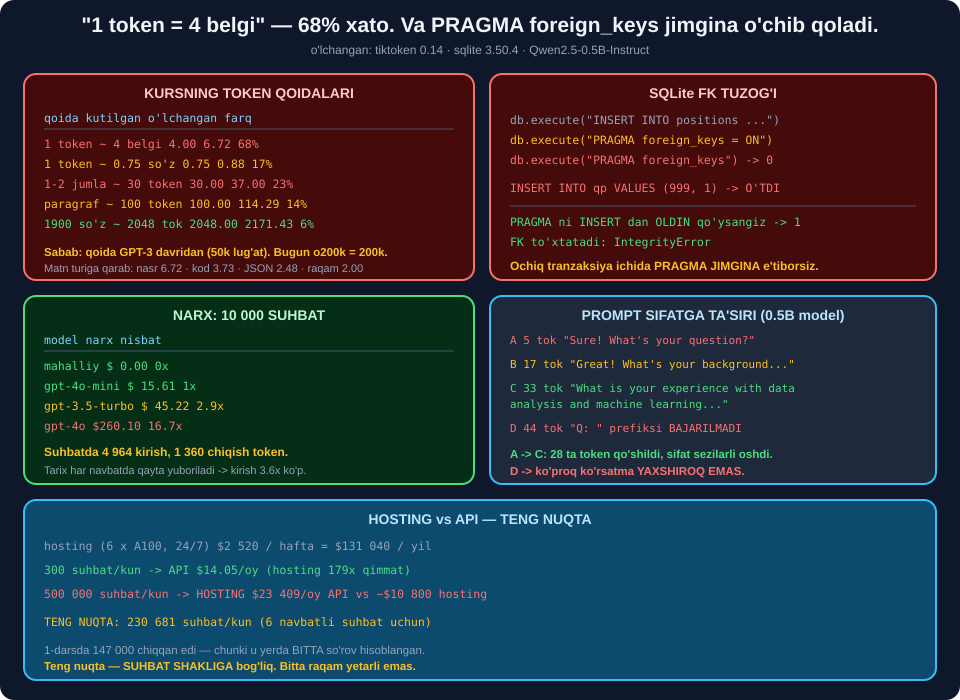

# 🗺️ 63-modul. LLM Engineering — rejalashtirish bosqichi

> ## ⭐⭐⭐ **KURS BESHTA TOKEN QOIDASINI BERADI. BIZ BESHTASINI HAM O'LCHADIK.**
>
> ## 💥 **ENG MASHHURI — "1 token ≈ 4 belgi" — 68% XATO.**
>
> ## 💥 **VA `PRAGMA foreign_keys` JIMGINA O'CHIB QOLISHINI TOPDIK.**



---

## 📚 Darslar

| # | Dars | Nima o'rganasiz |
|---|---|---|
| 1 | [Hosting vs API](01-Hosting-vs-API.md) ⭐⭐ | ## 🏆 **Teng nuqta: 1.7 so'rov/s** |
| 2 | [Ochiq vs yopiq](02-Open-vs-Closed-Source.md) ⭐⭐ | ## 💥 **"Ko'proq parametr" ≠ yaxshiroq** · `int4` |
| 3 | [Tokenlar](03-Tokens.md) ⭐⭐⭐ | ## 💥 **"4 belgi" 68% xato** · 3.4× diapazon |
| 4 | [Narx](04-Pricing.md) ⭐⭐ | ## 💥 **16.7× farq** · byudjet nazorati |
| 5 | [Prompt — 1](05-Initial-Prompt-Development-1.md) ⭐⭐ | ## 🏆 **5 qismli prompt** · format tuzog'i |
| 6 | [Prompt — 2](06-Initial-Prompt-Development-2.md) ⭐⭐ | ## 🏆 **JSON + himoyalangan parser** |
| 7 | [MB dizayni](07-Database-Design.md) ⭐⭐⭐ | ## 💥 **`PRAGMA foreign_keys` tuzog'i** |
| 8 | [Faoliyat diagrammasi](08-What-Is-an-Activity-Diagram.md) ⭐ | ## 🏆 **Mermaid** · yo'llar = testlar |
| 9 | [Diagramma yaratish](09-Creating-an-Activity-Diagram.md) ⭐⭐ | ## 💥 **Ikkita bo'shliq topildi** |
| 10 | [Yakunlash](10-Concluding-the-Planning-Stage.md) ⭐ | ## 🏆 **Reja hisoboti** |

---

## 📝 Amaliyot

| | |
|---|---|
| 📝 [**22 ta mashq**](MASHQLAR.md) | 🟢 Oson · 🟡 O'rta · 🔴 Qiyin |
| 🚀 [**3 ta mini-loyiha**](LOYIHALAR.md) | 💰 **LoyihaKalkulyator** · 🗄️ **SavollarBazasi** · 📐 **DiagrammaTekshiruvchi** |

---

## 💥💥💥 Bosh topilma: kursning token qoidalari

| # | Qoida | Kutilgan | ## O'lchangan | Farq |
|---|---|---|---|---|
| ## ① | **1 token ≈ 4 belgi** | 4.00 | ## 💥 **6.72** | ## 💥 **68%** |
| ② | 1 token ≈ 0.75 so'z | 0.75 | 0.88 | 17% |
| ③ | 100 token ≈ 75 so'z | 75.00 | 87.50 | 17% |
| ## ④ | **1–2 jumla ≈ 30 token** | 30.00 | ## 💥 **37.00** | 23% |
| ⑤ | Paragraf ≈ 100 token | 100.00 | 114.29 | 14% |
| ## ⑥ | 1 900 so'z ≈ 2 048 token | 2048 | ## ⭐ **2 171** | ## ✅ **6%** |

### 🔑 Nega?

```
   Qoida GPT-3 davridan (2020): p50k_base ~50 000 token
   Bugun (o200k_base):                    ~200 000 token
                                            ▲
                     4× katta lug'at = kamroq token = ko'proq belgi/token
```

### 💥 Va qoida matn turiga **3.4× bog'liq**

| Tur | Belgi/token |
|---|---|
| ## **Oddiy nasr** | ## 🏆 **6.72** |
| Texnik matn | 4.70 |
| Kod | 3.73 |
| O'zbekcha | 3.16 |
| URL/JSON | ## 💥 **2.48** |
| ## **Raqamlar** | ## 💥 **2.00** |

> ## 🏆 **QOIDA:** ## **Taxmin qilmang — `tiktoken` bilan SANANG.**

---

## 💥💥 Ikkinchi topilma: SQLite FK tuzog'i

```python
db.execute("INSERT INTO positions VALUES (1,'DS')")   # tranzaksiya ochiladi
db.execute("PRAGMA foreign_keys = ON")                # 💥 e'tiborsiz!
db.execute("PRAGMA foreign_keys").fetchone()[0]       # -> 0
db.execute("INSERT INTO qp VALUES (999, 1)")          # 💥 O'TDI
```

| Tartib | Pragma holati | Natija |
|---|---|---|
| ## **INSERT dan keyin** | ## 💥 **0** | ## 💥 **yolg'on ma'lumot kirdi** |
| INSERT dan oldin | ## ✅ **1** | ## ✅ **FK to'xtatdi** |

> ## 💥 **HECH QANDAY XATO BERMAYDI.** ## Va SQLite da FK **standart holda O'CHIQ**, ## har bir **yangi ulanishda** qayta yoqish kerak.
>
> ## ## ⭐ **YECHIM:** `PRAGMA` ni **ulanishdan keyin darrov** qo'ying.

---

## 📊 Modulda o'lchangan hamma narsa

### 💰 Narx

| Model | 10 000 suhbat *(6 navbat + baholash)* |
|---|---|
| ## **Mahalliy** | ## 🏆 **$0.00** |
| ## `gpt-4o-mini` | ## 🏆 **$15.61** |
| `gpt-3.5-turbo` | $45.22 *(2.9×)* |
| ## `gpt-4o` | ## 💥 **$260.10** *(16.7×)* |

### ⚖️ Hosting vs API

| | Qiymat |
|---|---|
| 180B `fp16` xotira | ## 💥 **469.39 GB** → **6 × A100** |
| Hosting | ## 💥 **$2 520/hafta** = $131 040/yil |
| ## **Teng nuqta** *(6 navbatli suhbat)* | ## **254 130 suhbat/kun** |
| 300 suhbat/kun | ## ⭐ **API** *(hosting 847× qimmat)* |
| 500 000 suhbat/kun | ## ⭐ **HOSTING** *(2× arzon)* |

> ## ⚠️ **TENG NUQTA — BITTA RAQAM EMAS.** ## 1-darsda **147 000** *(bitta so'rov)*, ## 10-darsda **230 681**, loyihada **254 130**. ## ## 🔑 **U SUHBAT SHAKLIGA bog'liq.**

### 🧠 Model xotirasi

| Model | `fp16` amaliy | ## `int4` amaliy | Noutbukda? |
|---|---|---|---|
| 0.5B | 1.30 GB | ## 🏆 **0.33 GB** | ## ✅ |
| 7B | 18.25 GB | ## ⭐ **4.56 GB** | ## ✅ |
| 8B | 20.86 GB | ⭐ 5.22 GB | ## ✅ |
| 70B | 182.54 GB | 45.63 GB | 💥 |
| 180B | ## 💥 **469.39 GB** | 117.35 GB | 💥 |

> ## 🏆 **`int4` BILAN 8B MODEL — 5.22 GB.** ## Oddiy o'yin videokartasida ishlaydi.

### 📝 Prompt

| | Tokenlar |
|---|---|
| Kursning tizim prompti | 183 → **212** *(to'ldirilgan)* |
| ## **Bizning 5 qismli** | ## ⭐ **138** *(25% kam, format bilan)* |
| `BAHO_PROMPT` + `JSON_FORMAT` | 309 |
| 6 navbatli suhbatda | ## 💥 **3 672 token** *(17.3×)* |

### 🔬 Prompt sifatga ta'siri *(0.5B model)*

| Variant | Token | Natija |
|---|---|---|
| ## **A** *(rol yo'q)* | 5 | ## 💥 **`"Sure! What's your question?"`** |
| **B** *(rol)* | 17 | ⚠️ preambula bor |
| ## **C** *(+ cheklov)* | 33 | ## ✅ **haqiqiy savol** |
| ## **D** *(+ format)* | 44 | ## 💥 **`Q: ` prefiksi bajarilmadi** |

> ## 🔑 **A → C: 28 ta qo'shimcha token, sezilarli yaxshilanish.** ## ## 💥 **C → D: ko'proq ko'rsatma, YOMONROQ natija.**

### 📋 JSON chiqish

```
✅ 0.5B model TO'G'RI JSON berdi, fence siz
💥 lekin: improvements 1 ta (2 talab qilingan)
💥 va: strengths NOMZOD nuqtai nazaridan ("I asked...")
```

> ## 🏆 **SINTAKSIS ✅ ≠ MAZMUN ✅.** ## ## ⭐ **Uch darajali tekshiruv kerak:** ## ① `json.loads()` · ② sxema · ③ **mantiq**.

### 📐 Diagramma

| | Qiymat |
|---|---|
| Yo'llar *(`max_tsikl=1`)* | 2 |
| ## Yo'llar *(`max_tsikl=2`)* | ## ⭐ **4** → **4 ta test** |
| Yo'llar *(`max_tsikl=3`)* | 6 |
| Topilgan tuzilish xatolari | ## 🏆 **3/3** |

> ## 🔧 **MEN BU YERDA XATO QILDIM:** ## `max_tsikl=1` ni *"tsikl bir marta aylanadi"* deb o'ylagandim. ## ## 💥 **Haqiqat: u "har bir tugunga bir marta kirish"** — ## tsikl **umuman aylanmaydi**.

---

## 💥 Kursdagi noaniqliklar

| Kurs aytadi | ## O'lchov |
|---|---|
| *"1 token ≈ 4 belgi"* | ## 💥 **6.72 — 68% xato** |
| *"1–2 jumla ≈ 30 token"* | ## 💥 **37 — 23% xato** |
| *"Falcon 180B — 4 × A100"* *(bizning taxminimiz)* | ## 💥 **6 ta kerak** |
| Baholash bandlari 1–4, 5–6, 7–8, 9–10 | ## 💥 **teng emas: 4, 2, 2, 2** |
| Prompt formati ko'rsatilmagan | ## 💥 **parse qilib bo'lmaydi** |
| Baholash — erkin matn | ## 💥 **JSON kerak** |
| Diagrammada xato yo'li yo'q | ## 💥 **cheksiz tsikl** |
| Foydalanuvchi kirishi tekshirilmaydi | ## 💥💥 **prompt injection** |

---

## ✅ Kurs to'g'ri aytgan narsalar

| Da'vo | Tekshiruv |
|---|---|
| Hosting **minglab dollar/hafta** | ## ✅ **$1 680–2 520** |
| Prototip uchun **API** | ## ✅ **to'g'ri tanlov** |
| *"Parametrlar — yagona omil emas"* | ## 🏆 **60-modulda isbotlaganmiz** |
| Har bir matn tokenga hissa qo'shadi | ## ✅ **eng muhim tushuncha** |
| `system`/`user`/`assistant` | ## ✅ **to'g'ri tushuntirish** |
| Baholash uchun **alohida so'rov** | ## 🏆 **14.2% qimmat, ancha ishonchli** |
| PK/FK/N:M nazariyasi | ## ✅ **to'g'ri** |
| Faoliyat diagrammasi elementlari | ## ✅ **to'g'ri** |
| *"Talablar — nazorat varag'i"* | ## ✅ **butunlay rozimiz** |

---

## 🏆 Rejalashtirishning darsi

> ## 🏆🏆🏆 **MAQSAD — "MUKAMMAL REJA" EMAS.**
>
> ## ## ⭐ **MAQSAD — QIMMAT XATOLARNI ARZON TOPISH.**

| Rejalashtirishda topildi | Kodda topilsa edi |
|---|---|
| Cheksiz tsikl | ## 💥 **hisob portlaydi** |
| FK pragma tuzog'i | ## 💥 **yolg'on ma'lumot bazada** |
| `gpt-4o` 16.7× qimmat | ## 💥 **birinchi hisobda** |
| Format ko'rsatmasi ishlamasligi | ## 💥 **parse xatolari** |
| Maxfiylik talabi yo'qligi | ## 💥💥 **huquqiy muammo** |

---

## 🔗 Bog'liq modullar

| Modul | Bog'liqlik |
|---|---|
| [60. Whisper](../60-Transcribing-with-Whisper/README.md) | Model o'lchamlari, gallyutsinatsiya |
| [62. LLM kirish](../62-LLM-Engineering-Introduction/README.md) | ## ⭐ Talablar, tokenlar, `LLMAdapter` |
| [64. Promptlar](../64-Crafting-and-Testing-Prompts/README.md) | ## 🏆 **Few-shot — format muammosining yechimi** |
| [67. Real muammolar](../67-Solving-Real-World-Challenges/README.md) | ## ⭐ Prompt injection, narxni kamaytirish |

---

🏠 [Kurs boshiga](../README.md) · 📝 [Mashqlar](MASHQLAR.md) · 🚀 [Loyihalar](LOYIHALAR.md)
