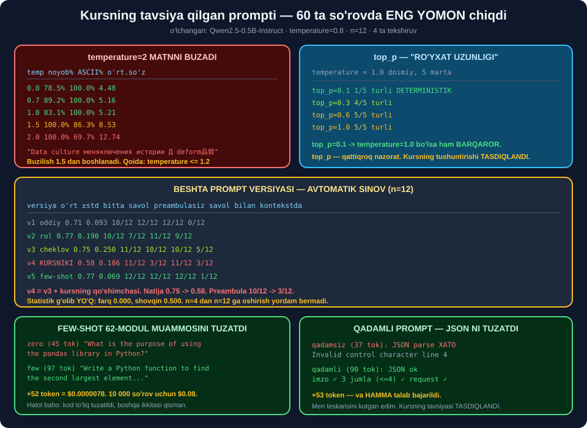

# ✍️ 64-modul. AI promptlarini yaratish va sinash

> ## ⭐⭐⭐ **KURS PROMPTGA BITTA QO'SHIMCHA TAVSIYA QILADI.**
>
> ## 🔬 **BIZ 5 TA VERSIYANI 60 TA SO'ROVDA O'LCHADIK.**
>
> ## 💥 **KURSNING VERSIYASI ENG YOMON CHIQDI — 0.58, BOSHQALARI 0.71–0.85.**



---

## 📚 Darslar

| # | Dars | Nima o'rganasiz |
|---|---|---|
| 1 | [Hisobga pul qo'shish](01-Adding-Funds.md) ⭐ | ## 🏆 **7 mln token = $2.31** · kalit xavfsizligi |
| 2 | [Playground va sozlamalar](02-The-OpenAI-Playground.md) ⭐⭐⭐ | ## 💥 **`temp=2` → ASCII 69.7%** · `top_p` |
| 3 | [`temperature` va `top_p`](03-Optimizing-Temperature-and-Top-P.md) ⭐⭐ | ## 💥 **`temp=0.8` da ball `0` chiqdi** |
| 4 | [Prompt muhandisligi](04-Prompt-Engineering.md) ⭐⭐⭐ | ## 🏆 **Few-shot 62-modul muammosini tuzatdi** |
| 5 | [Promptni sinash](05-How-to-Test-a-Prompt-Template.md) ⭐⭐⭐ | ## 💥 **Kursning qo'shimchasi eng yomon** |

---

## 📝 Amaliyot

| | |
|---|---|
| 📝 [**18 ta mashq**](MASHQLAR.md) | 🟢 Oson · 🟡 O'rta · 🔴 Qiyin |
| 🚀 [**2 ta mini-loyiha**](LOYIHALAR.md) | 🧪 **PromptLab** · 📋 **SozlamaTanlovchi** |

---

## 💥💥💥 Bosh topilma: kursning qo'shimchasi **zarar keltirdi**

| Versiya | Token | ## O'rtacha | ±std | `preambulasiz` |
|---|---|---|---|---|
| v1 oddiy | 5 | 0.71 | ⭐ 0.093 | 🏆 12/12 |
| ## **v2 rol** | 18 | ## 🏆 **0.77** | 0.190 | 7/12 |
| v3 cheklov | 31 | 0.75 | 💥 0.250 | 10/12 |
| ## **v4 kursniki** | 48 | ## 💥 **0.58** | 0.186 | ## 💥 **3/12** |
| ## **v5 few-shot** | 70 | ## 🏆 **0.85** | 0.160 | 🏆 12/12 |

> ## 💥💥 **`v4` = `v3` + KURSNING QO'SHIMCHASI.** ## Natija **0.75 → 0.58**.
>
> ## ## 🔑 **SABAB `preambulasiz` USTUNIDA:** ## `v3` — **10/12**, `v4` — ## 💥 **3/12**. ## ## ⚠️ *"creating a conversational flow"* modelni ## `"Great! Let's get started..."` deb boshlashga **undadi**.

> ## 🏆 **VA MANA NEGA AVTOMATIK SINOV KERAK:** ## qo'lda 2–3 marta ko'rganda bu **sezilmasdi**.

### ⚠️ Lekin statistik g'olib yo'q

```
farq 0.083  <=  shovqin 0.500      ⚠️ ISHONCHLI EMAS
```

> ## 🔑 **`n` ni 4 dan 12 ga oshirish yordam bermadi.** ## ## ⭐ **To'g'ri yo'l — o'rtachaga emas, ## HAR BIR TEKSHIRUVGA alohida qarash:**
>
> | Tekshiruv | G'olib |
> |---|---|
> | `bitta savol` | `v3 cheklov` *(11/12)* |
> | `preambulasiz` | `v1`, `v5` *(12/12)* |
> | `savol bilan` | `v1` *(12/12)* |
> | ## `kontekstda` | ## `v2 rol` *(9/12)* |
>
> ## ## 🏆 **BITTA "ENG YAXSHI PROMPT" YO'Q** — ## sizga **nima muhimligiga** bog'liq.

---

## 🏆 Ikkinchi topilma: few-shot 62-modul muammosini tuzatdi

```
62-modul (zero-shot, 45 tok):
  [kod] 💥 "What is the purpose of using the pandas library in Python?"

64-modul (few-shot, 97 tok):
  [kod] 🏆 "Write a Python function to find the second largest element..."
```

| Kategoriya | Zero-shot | ## Few-shot |
|---|---|---|
| `boshqotirma` | 💥 *"data cleaning maqsadi"* | ## ✅ *"How many people can you count..."* |
| ## `kod` | 💥 *"pandas nima uchun?"* | ## 🏆 *"Write a Python function..."* |
| `database` | 💥 *"MB maqsadi"* | ## ✅ *"primary key constraint on orders"* |

> ## 💰 **NARXI: +52 TOKEN = $0.0000078/so'rov.** ## 10 000 so'rov uchun **$0.08**.

> ## ⚠️ **HALOL BAHO:** ## `kod` — **to'liq** tuzatildi. ## `boshqotirma`, `database` — **mavzu tuzatildi, vazifa shakli qisman**.

### 💥 Va few-shot ning **yashirin narxi**

| | `v5 few-shot` | `v2 rol` |
|---|---|---|
| `preambulasiz` | 🏆 12/12 | 7/12 |
| ## `kontekstda` | ## 💥 **7/12** | ## 🏆 **9/12** |

> ## 🔑 **FEW-SHOT MISOLLARI MODELNI O'ZIGA TORTADI.** ## Misollar **tor** bo'lsa — natija ham **tor**.
>
> ## ## ⭐ **VA BUNI O'LCHADIK:** ## tor misollar bilan `kontekstda` **1/12**, ## kengroq misollar bilan — **7/12**.

---

## 📊 Modulda o'lchangan hamma narsa

### 🌡️ `temperature`

| Qiymat | Noyob so'z | ## ASCII | O'rt. so'z |
|---|---|---|---|
| 0.0 | 78.5% | ✅ 100.0% | 4.48 |
| 0.7 | 89.2% | ✅ 100.0% | 5.16 |
| 1.0 | 83.1% | ✅ 100.0% | 5.21 |
| ## 1.5 | 100.0% | ## ⚠️ **86.3%** | 8.53 |
| ## **2.0** | 100.0% | ## 💥 **69.7%** | ## 💥 **12.74** |

```
temp=2.0 chiqishi:
"Data culture меняключения истории Д deform品尝"
```

> ## ✅ **KURS HAQ.** ## Va buzilish **`1.5` dan** boshlanadi. ## ## 🏆 **QOIDA: `temperature ≤ 1.2`.**

### 🔁 Takrorlanuvchanlik

| Sozlama | Turli natija |
|---|---|
| ## `temperature=0.0` | ## ⭐ **1/5** |
| `temperature=0.3` | 💥 5/5 |
| `temperature=1.5` | 💥 5/5 |
| ## `top_p=0.1` *(temp=1.0)* | ## ⭐ **1/5** |
| `top_p=0.6` | 💥 5/5 |

> ## 💥 **`temperature=0.3` HAM DETERMINISTIK EMAS** — men xato kutgan edim. ## ## ⭐ **`top_p` — qattiqroq nazorat:** ## `0.1` da `temperature=1.0` bo'lsa ham **barqaror**.

### 💥 Baholashda `temperature`

```
temp=0.0: ballar [8, 8, 8, 8, 8]  parse xatolari 0/5
temp=0.8: ballar [8, 0, 8, 8, 7]  parse xatolari 0/5
```

> ## 💥💥 **IKKINCHI QIYMAT — `0`.** ## Promptda `1-10` deb yozilgan edi. ## ## ⚠️ **JSON parse esa O'TDI** — kod buni **sezmaydi**. ## ## 🏆 **Sxema tekshiruvi shart** *(63-modul)*.

### 📋 Kursning sozlamalar jadvali

| Holat | `temp`/`top_p` | Turli/3 |
|---|---|---|
| Kod | 0.3 / 0.3 | ⭐ 1/3 |
| Ma'lumot tahlili | 0.2 / 0.1 | ⭐ 1/3 |
| Hisobot | 0.3 / 0.5 | ⭐ 1/3 |
| Marketing matni | 0.3 / 0.5 | 💥 3/3 |
| Kampaniya g'oyalari | 1.1 / 1.0 | 💥 3/3 |
| Chatbot | 1.0 / 1.0 | 💥 3/3 |

> ## ✅ **MANTIQ ISHLAYDI.** ## ## 💥 **Lekin `marketing matni` va `hisobot` — bir xil sozlama, turli natija.** ## Sabab: **vazifaning o'zi** qanchalik "ochiq".

### 📝 Qadamli prompt

```
[qadamsiz] 37 tok · JSON: 💥 Invalid control character
[qadamli ] 90 tok · JSON: ✅ ok · imzo ✓ · 3 jumla ✓ · request ✓
```

> ## 🏆 **+53 TOKEN — VA HAMMA TALAB BAJARILDI.** ## Men **teskarisini kutgan edim**.

### 💰 Prompt ishlab chiqish narxi

| Model | 7 mln token |
|---|---|
| ## `gpt-4o-mini` | ## 🏆 **$2.31** |
| `gpt-4o` | 💥 $38.50 |
| ## Mahalliy | ## 🏆 **$0.00** |

> ## ⭐ **$5 MINIMAL TO'LDIRISH ARZON MODELDA YETADI.**

---

## 💥 Kursdagi noaniqliklar

| Kurs aytadi | ## O'lchov |
|---|---|
| *"Ask each question individually..."* qo'shing | ## 💥 **0.75 → 0.58**, eng yomon versiya |
| Sozlamalar jadvalida `temperature=0` yo'q | ## 💥 **JSON/SQL uchun eng to'g'ri qiymat** |
| Promptni qo'lda 2–3 marta sinash | ## 💥 **namuna juda kichik** |
| *"Yaxshi ko'rinadi"* | ## 💥 **subyektiv — tekshiruv funksiyasi kerak** |
| Baholash sozlamasi ko'rsatilmagan | ## 💥 **`temp=0.8` da ball `0` chiqdi** |

---

## ✅ Kurs to'g'ri aytgan narsalar

| Da'vo | Tekshiruv |
|---|---|
| `temperature=2` matnni buzadi | ## 🏆 **ASCII 69.7%** |
| `top_p` — "ro'yxat uzunligi" | ## 🏆 **`0.1` da deterministik** |
| Past sozlama = mantiqiy vazifalar | ## ✅ **1/3 vs 3/3** |
| ChatGPT emas, Playground | ## ✅ **muhim va to'g'ri** |
| ## **Few-shot promptlash** | ## 🏆 **62-modul muammosini tuzatdi** |
| ## **Qadamlarni ko'rsatish** | ## 🏆 **JSON ni tuzatdi** |
| Strukturalangan javob *(JSON)* | ## ✅ **63-modulda tasdiqlandi** |
| Murakkab vazifani bo'lish | ## ✅ **63-modulda tasdiqlandi** |
| *"Prompt — iterativ jarayon"* | ## ✅ **butunlay rozimiz** |

---

## 🚀 Tez boshlash

```python
import torch
from transformers import pipeline

llm = pipeline("text-generation", model="Qwen/Qwen2.5-0.5B-Instruct",
               device=-1, dtype="auto")

PROFIL = {
    "json":    {"do_sample": False},                                  # ⭐ barqaror
    "kod":     {"do_sample": True, "temperature": 0.2, "top_p": 0.3, "top_k": 0},
    "savol":   {"do_sample": True, "temperature": 0.8, "top_p": 1.0, "top_k": 0},
}


def sora(tizim, kirish, vazifa="savol", max_tokens=120, urug=0):
    torch.manual_seed(urug)
    o = llm([{"role": "system", "content": tizim},
             {"role": "user", "content": kirish}],
            max_new_tokens=max_tokens, **PROFIL[vazifa])
    return o[0]["generated_text"][-1]["content"].strip()
```

---

## 🔗 Bog'liq modullar

| Modul | Bog'liqlik |
|---|---|
| [62. LLM kirish](../62-LLM-Engineering-Introduction/README.md) | ## ⭐ Kategoriya muammosi — bu modulda tuzatildi |
| [63. Rejalashtirish](../63-LLM-Planning-Stage/README.md) | ## ⭐ Prompt tuzilishi, JSON, sxema tekshiruvi |
| [65. Streamlit](../65-Getting-to-Know-Streamlit/README.md) | ## 🏆 **Interfeys** |
| [67. Real muammolar](../67-Solving-Real-World-Challenges/README.md) | ## ⭐ Prompt injection, gallyutsinatsiya |

---

🏠 [Kurs boshiga](../README.md) · 📝 [Mashqlar](MASHQLAR.md) · 🚀 [Loyihalar](LOYIHALAR.md)
