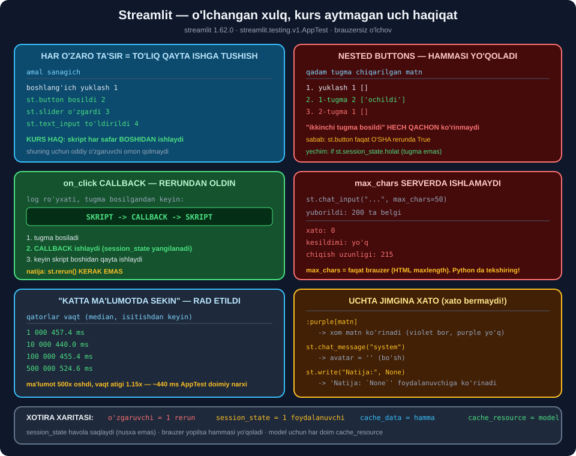

# 🖥️ 65-modul. Streamlit bilan tanishuv

> ## ⭐⭐⭐ **KURS BU MODULNI BRAUZERDA KO'RSATADI.**
>
> ## 🔬 **BIZ HAMMASINI `streamlit.testing.v1.AppTest` BILAN — BRAUZERSIZ — O'LCHADIK.**
>
> ## 💥 **VA UCHTA "JIMGINA XATO" TOPDIK: XATO BERMAYDI, LEKIN NOTO'G'RI ISHLAYDI.**



---

## 📚 Darslar

| # | Dars | Nima o'rganasiz |
|---|---|---|
| 1 | [Muhitni sozlash](01-Setting-Up-Environment.md) ⭐ | ## `venv` vs Anaconda · ## 🏆 **`AppTest` — brauzersiz sinov** |
| 2 | [Streamlit: afzallik va kamchilik](02-Streamlit-Pros-and-Cons.md) ⭐⭐ | ## 💥 **"katta ma'lumotda sekin" — RAD ETILDI** |
| 3 | [Sarlavhalar va formatlash](03-Titles-Headers-Formatting.md) ⭐ | ## 💥 **`:purple[]` jimgina xato** · 9 ta rang |
| 4 | [Matn metodlari](04-Text-Methods.md) ⭐⭐ | ## `st.write` 8/8 tur · ## ⭐ **`cache_data` vs `cache_resource`** |
| 5 | [Chat elementlari](05-Chat-Elements.md) ⭐⭐⭐ | ## 💥 **`max_chars` serverda ISHLAMAYDI** |
| 6 | [Session State](06-Session-State.md) ⭐⭐⭐⭐ | ## 🏆 **`on_click` rerundan OLDIN ishlaydi** |

---

## 📝 Amaliyot

| | |
|---|---|
| 📝 [**20 ta mashq**](MASHQLAR.md) | 🟢 Oson · 🟡 O'rta · 🔴 Qiyin |
| 🚀 [**2 ta mini-loyiha**](LOYIHALAR.md) | 🧪 **StreamlitSinov** · 🎤 **Ace Interview** |

---

## 💥💥💥 Bosh topilma: **`max_chars` — faqat brauzer bezagi**

Kurs aytadi: *"`max_chars` parametrini 50 ga qo'ysangiz, belgi chegarasi paydo bo'ladi"*.

```python
at.chat_input[0].set_value("A" * 200).run()      # chegara 50 edi
```

```
xato: 0
kesildimi: yo'q
chiqish uzunligi: 215
```

> ## 💥💥💥 **200 TA BELGI — XATOSIZ O'TDI.**
>
> ## ## 🔑 **SABAB:** ## `max_chars` — bu HTML `maxlength`, ## ya'ni **brauzer** cheklovi. ## Serverda **hech qanday tekshiruv yo'q**.

> ## 💰 **VA LLM ILOVASIDA BU — PUL:** ## 200 000 belgi ≈ 50 000 token ≈ ## 💥 **$0.50+ bitta so'rov uchun**.

### ✅ Yechim — **ikki qavat**

```python
prompt = st.chat_input("Javobingiz", max_chars=500)   # ① brauzer — qulaylik

if prompt:
    if len(prompt.strip()) > 500:                     # ② Python — HIMOYA
        st.error("💥 juda uzun"); st.stop()
```

---

## 🏆 Ikkinchi topilma: `on_click` **rerundan OLDIN** ishlaydi

```python
st.session_state.log.append("SKRIPT")
st.button("Bos", on_click=lambda: st.session_state.log.append("CALLBACK"))
```

```
① ['SKRIPT']
② ['SKRIPT -> CALLBACK -> SKRIPT']
```

> ## 🏆🏆 **TARTIB:** ## ① tugma bosildi → ## ② **callback** → ## ③ skript **boshidan**.
>
> ## ## ⭐ **NATIJA: `st.rerun()` KERAK EMAS.** ## Callback `session_state` ni o'zgartirsa, ## skript **allaqachon yangi holat bilan** ishlaydi.

> ## 💡 **KURS BU HAQDA UMUMAN GAPIRMAYDI** — ## u `nested buttons` ni faqat ## `if` bloklari bilan hal qiladi.

---

## 💥 Uchta **jimgina xato** — xato bermaydi, lekin noto'g'ri

| Kod | Kutilgan | ## Haqiqiy |
|---|---|---|
| `st.write(":purple[matn]")` | rangli matn | ## 💥 **`:purple[matn]`** xom holda |
| `st.chat_message("system")` | avatar | ## 💥 **`avatar=''`** |
| `st.write("Natija:", None)` | *(men: yo'qoladi)* | ## 💥 **`Natija: \`None\``** |

> ## 🔑 **UCHALASIDA HAM `len(at.exception) == 0`.**
>
> ## ## ⭐ **VA MANA NEGA `AppTest` KERAK:** ## bunday xatolarni faqat ## **natijani tekshirib** topasiz.

### ⚠️ Va uchinchisida **men xato qildim**

Men *"`st.write` `None` ni jimgina tashlab yuboradi"* deb yozgan edim. **O'lchov buni rad etdi:**

```text
st.write("Natija:", None)   ->   ['Natija: `None`']
```

> ## 🔧 **`None` YO'QOLMAYDI — U KO'RINADI.** ## ⚠️ Baribir foydalanuvchi uchun ## **texnik nosozlik** taassuroti. ## ## ⭐ Qoida o'zgarmaydi: `st.write` ga `None` bermang.

---

## 💥 To'rtinchi topilma: **"katta ma'lumotda sekin" — rad etildi**

| Qatorlar | Vaqt *(median, isitishdan keyin)* |
|---|---|
| 1 000 | 457.4 ms |
| 10 000 | 440.0 ms |
| 100 000 | 455.4 ms |
| ## **500 000** | ## **524.6 ms** |
| ## *bo'sh skript* | ## ⭐ **424.5 ms** |

> ## 💥💥 **MA'LUMOT 500× OSHDI — VAQT 1.15×.**
>
> ## ## 🔑 **~424 ms — bu `AppTest` NING DOIMIY NARXI,** ## `st.dataframe` esa ma'lumotni **serializatsiya** qiladi, ## brauzer **kerakli qismini** ko'rsatadi.

> ## 🔧 **VA BU YERDA MEN IKKI MARTA XATO QILDIM:** ## birinchi o'lchovim **isitishsiz** edi — ## 1 000 qator **1 151.8 ms**, ## 10 000 qator **457.9 ms** chiqdi. ## ## 🏆 **DARS: birinchi chaqiruvni tashlab yuboring.**

---

## 📊 Modulda o'lchangan hamma narsa

### 🔁 Qayta ishga tushish

| Amal | Sanagich |
|---|---|
| boshlang'ich yuklash | 1 |
| `st.button` | 2 |
| `st.slider` | 3 |
| `st.text_input` | 4 |
| `st.checkbox` | ✅ |
| `st.selectbox` | ✅ |
| `st.number_input` | ✅ |

> ## ✅ **KURS HAQ:** ## **oltita widget, oltitasi ham** ## skriptni **boshidan** ishga tushiradi.

### 💥 `nested buttons` muammosi

| Qadam | Tugma | Matn |
|---|---|---|
| 1. yuklash | 1 | `[]` |
| 2. 1-tugma | 2 | `['ochildi']` |
| ## **3. 2-tugma** | ## 💥 **1** | ## 💥 **`[]`** |

```
"ikkinchi tugma bosildi" — HECH QACHON ko'rinmaydi
```

> ## 🔑 **SABAB — `st.button` BIR MARTALIK:**
>
> | Widget | Keyingi rerunda |
> |---|---|
> | ## `st.button` | ## 💥 **`False`** |
> | ## `st.checkbox` | ## ✅ **saqlanadi** |

### ⭐ Kurs **topshiriq** qilib qoldirgan qism

Kurs: *"2-tugmaga ham session state qo'shish mumkin — buni sizga topshiriq qilib qoldiraman."*

```
1-tugma QAYTA bosildi -> ['ochildi']
💥 "ikkinchi tugma bosildi" YO'QOLDI
```

> ## ✅ **KURS HAQ EDI.** ## Men buni **tekshirdim**, chunki *"balki abzalligi bordir"* deb o'ylagandim.

### 🎭 `chat_message` rollari

| Rol | `avatar` |
|---|---|
| `user` / `assistant` | ✅ o'zi |
| ## `ai` | ## ⭐ **`assistant`** |
| ## `human` | ## ⭐ **`user`** |
| ## `system`, `"Aziz"`, `""` | ## 💥 **`''`** |
| `"🤖"` | ⭐ `'🤖'` |

### 🌊 `write_stream`

| Savol | Javob |
|---|---|
| Nima qaytaradi? | ## 🏆 **to'plangan `str`** |
| Satr bersak? | `StreamlitAPIException` *(yaxshi xabar)* |
| Bloklaydimi? | ## ⚠️ **ha** — 0.5 s uyqu = 0.94 s jami |
| O'rtada xato? | ## ⭐ **yarim matn ekranda qoladi** |

### 💾 Kesh

| | `@st.cache_data` | `@st.cache_resource` |
|---|---|---|
| `a is b` | ## ✅ **`False`** *(nusxa)* | ## ⚠️ **`True`** |
| O'zgartirish | xavfsiz | ## 💥 **hammaga tegadi** |
| `f(1)` vs `f(1.0)` | ## ⭐ **alohida kesh** | — |
| Ro'yxat argument | ## ✅ **ishlaydi** *(men xato kutgandim)* | — |

### 🧠 `session_state`

| Xulq | Natija |
|---|---|
| Havola yoki nusxa? | ## 💥 **havola** — ro'yxat rerunlarda o'sadi |
| `del` mumkinmi? | ✅ ha, keyin `.get()` ishlating |
| Widgetdan oldin qiymat? | ## ⭐ **mumkin** — widget shundan boshlanadi |
| `lambda`, `open` saqlaydimi? | ✅ ha, cheklov yo'q |
| `at.session_state.get(...)` | ## 💥 **`AttributeError`** |

### 💥 `chat_input` tuzoqlari

| Kirish | `bool(prompt)` |
|---|---|
| `None` *(boshlang'ich)* | `False` |
| `""` | `False` |
| ## `"   "` | ## 💥 **`True`** |

> ## ⭐ **TO'G'RI SHART:** `if prompt and prompt.strip():`

---

## 💥 Kursdagi noaniqliklar

| Kurs aytadi | ## O'lchov |
|---|---|
| `max_chars` — belgi chegarasi | ## 💥 **faqat brauzerda; 200 belgi o'tdi** |
| "Katta ma'lumotlarda sekin" | ## 💥 **1k va 500k — 457 vs 524 ms** |
| `:blue[...]` sintaksisi | ## 💥 **noto'g'ri rang jimgina o'tadi** |
| *"istalgan qo'llab-quvvatlanadigan satr"* rol | ## 💥 **`avatar=''` bo'lib qoladi** |
| `nested buttons` — faqat `if` bilan | ## ⭐ **`on_click` toza yechim beradi** |
| Anaconda tavsiya qilinadi | ## ⭐ **`venv` yetarli** |
| Brauzerda qo'lda sinash | ## 🏆 **`AppTest` — 425 ms, CI da ishlaydi** |

---

## ✅ Kurs to'g'ri aytgan narsalar

| Da'vo | Tekshiruv |
|---|---|
| Har o'zaro ta'sirda **butun skript** qayta ishlaydi | ## 🏆 **1→2→3→4** |
| `nested buttons` buziladi | ## 🏆 **tugmalar 2→1, matn yo'qoladi** |
| `session_state` — yechim | ## 🏆 **tasdiqlandi** |
| *"2-tugmaga ham kerak bo'lishi mumkin"* | ## 🏆 **HAQ** |
| `st.write` — eng ko'p qirrali | ## ✅ **8/8 tur** |
| Chat xabariga jadval/rasm | ## ✅ **`Dataframe` ichkarida** |
| `st.text` — formatlashsiz | ## ✅ **XSS himoyasi** |

---

## 🚀 Tez boshlash

```python
import warnings; warnings.filterwarnings("ignore")
from streamlit.testing.v1 import AppTest

kod = '''
import streamlit as st
st.session_state.setdefault("tarix", [])

for x in st.session_state.tarix:
    with st.chat_message(x["rol"]):
        st.write(x["matn"])

p = st.chat_input("Yozing", max_chars=300)
if p and p.strip():                          # ⭐ IKKALASI HAM
    if len(p.strip()) > 300:                 # ⭐ SERVER TEKSHIRUVI
        st.error("juda uzun"); st.stop()
    st.session_state.tarix.append({"rol": "user", "matn": p.strip()})
    st.rerun()
'''

at = AppTest.from_string(kod); at.run()
at.chat_input[0].set_value("Salom").run()
print(len(at.exception), at.session_state.tarix)
```

```
0 [{'rol': 'user', 'matn': 'Salom'}]
```

---

## 🔗 Bog'liq modullar

| Modul | Bog'liqlik |
|---|---|
| [63. Rejalashtirish](../63-LLM-Planning-Stage/README.md) | ## ⭐ Talablar, token hisobi |
| [64. Promptlar](../64-Crafting-and-Testing-Prompts/README.md) | ## ⭐ Prompt — bu ilovaga kiradi |
| [66. Prototip](../66-Developing-the-Prototype/README.md) | ## 🏆 **Bu karkasga LLM ulanadi** |
| [67. Real muammolar](../67-Solving-Real-World-Challenges/README.md) | ## ⭐ `prompt injection` — `unsafe_allow_html` ning ukasi |

---

🏠 [Kurs boshiga](../README.md) · 📝 [Mashqlar](MASHQLAR.md) · 🚀 [Loyihalar](LOYIHALAR.md)
