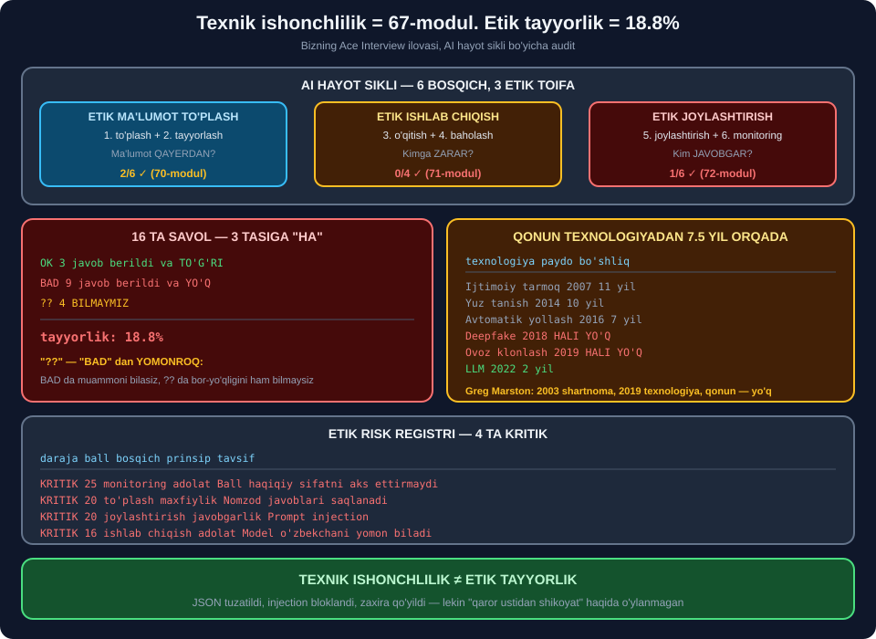

# ⚖️ 68-modul. AI va ma'lumot etikasiga kirish

> ## ⭐⭐⭐ **BU BO'LIMDA SAVOL O'ZGARADI: "ISHLAYDIMI?" EMAS, "HAQLIMIZMI?"**
>
> ## 🔬 **BIZ 66–67-MODULLARDA QURGAN ILOVANI AUDIT QILDIK.**
>
> ## 💥 **NATIJA: 16 TA ETIK SAVOLDAN 3 TASI — 18.8%.**



---

## 📚 Darslar

| # | Dars | Nima o'rganasiz |
|---|---|---|
| 1 | [Kurs nimalarni qamrab oladi](01-What-Does-the-Course-Cover.md) ⭐ | ## Uchta hodisa · **etik risk registri** |
| 2 | [AI hayot sikli](02-The-AI-Lifecycle.md) ⭐⭐ | ## 💥 **Ilovamiz auditi: 18.8%** |
| 3 | [Nega etika muhim](03-Why-AI-Ethics-Matter.md) ⭐⭐ | ## Marston, Clearview · **rozilik siyosati 71%** |
| 4 | [Etika va qonun](04-Ethics-vs-Laws.md) ⭐⭐ | ## 💥 **Qonun 7.5 yil orqada** |

---

## 📝 Amaliyot

| | |
|---|---|
| 📝 [**12 ta mashq**](MASHQLAR.md) | 🟢 Oson · 🟡 O'rta · 🔴 Qiyin |

---

## 💥💥💥 Bosh topilma: **texnik ishonchlilik ≠ etik tayyorlik**

67-modulda biz ilovani *"ishonchli"* deb atagan edik:

| Texnik | Natija |
|---|---|
| JSON | ## 🏆 **0/10 → 10/10** |
| Injection | ## 🏆 **5/5 bloklandi** |
| Zaxira | ## 🏆 **6/6 xizmat ishladi** |

### 🔬 Endi — **etik audit**

```
  [etik to'plash] ma'lumot to'plash
    ✅ Ma'lumot egasi rozilik berganmi?
    ✅ Manba litsenziyasi tekshirilganmi?
    💥 Shaxsiy ma'lumot (PII) aniqlanganmi?
    ⚠️ Guruhlar teng vakillik qilganmi?
  ...
XULOSA: ✅ 3   💥 9   ⚠️ 4   (jami 16)
tayyorlik: 18.8%
```

> ## 💥💥💥 **18.8%.**
>
> ## Biz JSON ni tuzatdik, injection ni blokladik, ## zaxira qo'ydik — ## lekin ## ⭐ **"qaror ustidan shikoyat qilish mumkinmi?"** ## degan savolni **umuman bermagan** edik.

---

## ⚠️ Ikkinchi topilma: `⚠️` — **eng xavfli javob**

| Belgi | Ma'nosi | Nega |
|---|---|---|
| ✅ | Tekshirildi, joyida | — |
| 💥 | Tekshirildi, **muammo bor** | ## ⭐ **Kamida bilasiz** |
| ## ⚠️ | ## **Bilmaymiz** | ## 💥 **Muammo bor-yo'qligi ham noma'lum** |

```
⚠️ Guruhlar teng vakillik qilganmi?      -> MB dagi 1500 savolni tahlil qilmadik
⚠️ Bo'sh qiymatlar qaysi guruhda ko'p?   -> umuman qaramadik
⚠️ Loglar saqlanadimi va qancha?         -> siyosat yo'q
```

> ## 🏆 **BIRINCHI QADAM — `⚠️` NI O'LCHASH.** ## ⭐ 69-modulda **bias auditini** qilamiz.

---

## 💥 Uchinchi topilma: **qonun 7.5 yil orqada**

| Texnologiya | Paydo | Hujjat | Bo'shliq |
|---|---|---|---|
| Ijtimoiy tarmoq ma'lumoti | 2007 | GDPR | 11 yil |
| Yuz tanish | 2014 | EU AI Act | 10 yil |
| Avtomatik yollash | 2016 | NYC LL 144 | 7 yil |
| ## **Deepfake** | 2018 | — | ## 💥 **HALI YO'Q** |
| ## **Ovoz klonlash** | 2019 | — | ## 💥 **HALI YO'Q** |
| Generativ matn (LLM) | 2022 | EU AI Act | ⭐ 2 yil |

```
o'rtacha bo'shliq: 7.5 yil
hali qonunsiz    : 2/6
```

> ## 💡 **VA GREG MARSTON ISHI SHU JADVALDA:** ## shartnoma **2003**, texnologiya **2019**, qonun — ## 💥 **hali yo'q**.
>
> ## ## 🏆 **XULOSA: `"QONUN YO'Q"` ≠ `"HAMMA NARSA MUMKIN"`.**

---

## 📊 Modulda o'lchangan hamma narsa

| O'lchov | Natija |
|---|---|
| Hayot sikli auditi | ## 💥 **3/16 = 18.8%** |
| Etik risklar | ## 💥 **4 ta KRITIK** *(eng yuqori 25 ball)* |
| Rozilik siyosati | ## ⚠️ **71%** |
| Model kartasi | ## 💥 **50%** |
| Etik e'lon | ## ⚠️ **4/5 band** |
| ## **UMUMIY** | ## 💥 **54.9%** |
| Regulyatsiya bo'shlig'i | 💥 7.5 yil |
| Qaror daraxti | ## 🛑 **"TO'XTATING"** |

> ## ⚠️ **VA `54.9%` — O'RTACHA QIYMAT,** ## u **haqiqiy holatni yashiradi**: ## eng past ball — ## 💥 **18.8%**.

---

## 🏆 Kurs to'g'ri aytgan narsalar

| Da'vo | Baho |
|---|---|
| *"Etika — samolyotdagi velosiped tormozi"* | ## 🏆 **7.5 yil bo'shliq bilan tasdiqlandi** |
| Hayot siklini 3 toifaga bo'lish | ## 🏆 **Audit ramkasi bo'lib xizmat qildi** |
| *"Sikl joylashtirishda tugamaydi"* | ## ✅ **Model drift** |
| *"Javobgarlik odamda"* | ## ✅ **Javobgarlik matritsasi** |
| *"Qonunlar orqada qoladi"* | ## 🏆 **O'lchandi** |
| Clearview, Marston, Grok misollari | ## ⭐ **Uchalasi ham amaliy** |

---

## ⚠️ Kursda yetishmagan narsalar

| Yetishmaydi | Nega muhim |
|---|---|
| ## **Statistika manbasi** | *"10% ishchi"* — manba ko'rsatilmagan |
| ## **Amaliy vosita** | Etika **tushuntiriladi**, lekin **o'lchanmaydi** |
| Audit ro'yxati | ## ⭐ Biz **16 ta savol** tuzdik |
| Risk baholash | ## ⭐ Biz **registr** qurdik |
| ## **Shikoyat mexanizmi** | Umuman eslatilmagan |

---

## 🚀 Tez boshlash — **etik audit 10 daqiqada**

```python
SAVOLLAR = [
    # to'plash
    "Ma'lumot egasi rozilik berganmi?",
    "Shaxsiy ma'lumot (PII) aniqlanganmi?",
    "Guruhlar teng vakillik qilganmi?",
    # ishlab chiqish
    "Metrikalar guruhlar bo'yicha ajratib hisoblanganmi?",
    "Eng yomon guruh natijasi ma'lummi?",
    # joylashtirish
    "Foydalanuvchi AI bilan gaplashayotganini biladimi?",
    "Qaror ustidan shikoyat qilish mumkinmi?",
    # monitoring
    "Muntazam bias auditi bormi?",
    "Modelni o'chirish rejasi bormi?",
]


def audit(javoblar):
    ok = sum(1 for s in SAVOLLAR if javoblar.get(s) is True)
    bilmayman = sum(1 for s in SAVOLLAR if javoblar.get(s) is None)
    print(f"✅ {ok}   💥 {len(SAVOLLAR)-ok-bilmayman}   ⚠️ {bilmayman}")
    print(f"tayyorlik: {ok/len(SAVOLLAR)*100:.1f}%")
    for s in SAVOLLAR:
        if javoblar.get(s) is not True:
            print(f"  {'⚠️' if javoblar.get(s) is None else '💥'} {s}")
```

> ## 🏆 **TO'QQIZTA SAVOL — VA SIZ ALLAQACHON ## KO'PCHILIKDAN OLDINDASIZ.**

---

## 🔗 Bog'liq modullar

| Modul | Bog'liqlik |
|---|---|
| [66. Prototip](../66-Developing-the-Prototype/README.md) | ⭐ Audit qilinayotgan ilova |
| [67. Real muammolar](../67-Solving-Real-World-Challenges/README.md) | ## ⭐ Texnik ishonchlilik |
| [69. Asosiy prinsiplar](../69-Core-Principles-of-AI-Ethics/README.md) | ## 🏆 **To'rtta prinsip** |
| [76. Regulyatsiya](../76-Data-and-AI-Regulatory-Frameworks/README.md) | ⭐ GDPR, EU AI Act |

---

🏠 [Kurs boshiga](../README.md) · 📝 [Mashqlar](MASHQLAR.md)
