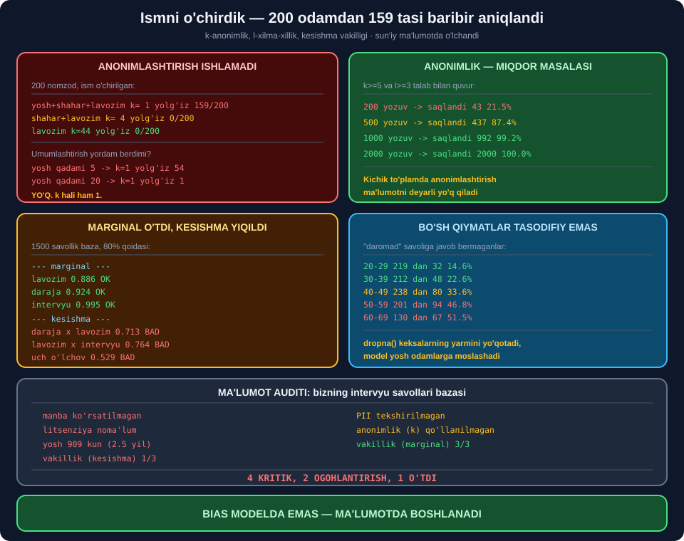

# 📦 70-modul. Etik ma'lumot to'plash

> ## ⭐⭐⭐ **AI HAYOT SIKLINING BIRINCHI BOSQICHI — VA ENG KO'P XATO SHU YERDA.**
>
> ## 🔬 **BIZ ISMNI O'CHIRDIK — 200 ODAMDAN 159 TASI BARIBIR ANIQLANDI.**
>
> ## 💥 **VA BAZAMIZ TO'RTTA MAYDONDA 80% QOIDASINI O'TDI, IKKITASINI BIRLASHTIRGACH — YIQILDI.**



---

## 📚 Darslar

| # | Dars | Nima o'rganasiz |
|---|---|---|
| 1 | [Etik manbadan olish](01-Ethical-Sourcing.md) ⭐⭐ | Common Crawl · ## **manba jurnali** |
| 2 | [Xususiy ma'lumot](02-Proprietary-Data.md) ⭐⭐ | RBS ishi · ## **rolga qarab filtr** |
| 3 | [Ommaviy ma'lumot](03-Public-Data.md) ⭐⭐ | ## 💥 **Bo'sh qiymat biasi: 14.6% vs 51.5%** |
| 4 | [Skreyp qilingan ma'lumot](04-Web-Scraped-Data.md) ⭐⭐⭐ | Mumsnet · ## **`robots.txt` tahlilchisi** |
| 5 | [Nozik ma'lumot](05-Sensitive-Information.md) ⭐⭐⭐⭐ | ## 💥 **`k`=1: 159/200 aniqlanadi** |
| 6 | [Bias va vakillik](06-Data-Bias-and-Representation.md) ⭐⭐⭐⭐ | ## 💥 **Kesishma: 0.713** |

---

## 📝 Amaliyot

| | |
|---|---|
| 📝 [**14 ta mashq**](MASHQLAR.md) | 🟢 Oson · 🟡 O'rta · 🔴 Qiyin |

---

## 💥💥💥 Bosh topilma: **ism o'chirish anonimlashtirish emas**

Kurs aytadi: *"anonimlashtirish — ism, manzil va tibbiy ID larni olib tashlash"*.

### 🔬 Shuni qildik — 200 nomzod

```
kvazi-identifikator ['yosh', 'shahar', 'lavozim']   k=  1  yolg'iz=159/200
kvazi-identifikator ['shahar', 'lavozim']           k=  4  yolg'iz=0/200
kvazi-identifikator ['lavozim']                     k= 44  yolg'iz=0/200
```

> ## 💥 **200 TADAN 159 TASI AYNAN ANIQLANADI.** ## Yosh + shahar + lavozim — ## ⭐ **kvazi-identifikator**.

### 💥 Va umumlashtirish yordam bermadi

```
yosh qadami=  1  k=1  yolg'iz=159
yosh qadami=  5  k=1  yolg'iz= 54
yosh qadami= 10  k=1  yolg'iz= 15
yosh qadami= 20  k=1  yolg'iz=  1
```

> ## 🔧 **MEN 20 YILLIK ORALIQ YETARLI DEB O'YLAGAN EDIM.** ## ## 💥 **`k` HALI HAM 1.**

### 🏆 Haqiqiy yechim — **ko'proq ma'lumot**

```
  200 yozuv  ->  saqlandi    43 ( 21.5%)
  500 yozuv  ->  saqlandi   437 ( 87.4%)
 1000 yozuv  ->  saqlandi   992 ( 99.2%)
 2000 yozuv  ->  saqlandi  2000 (100.0%)
```

> ## 🏆🏆 **ANONIMLIK — MIQDOR MASALASI.** ## ## 💡 Kichik so'rovnomalar ## ⭐ **ochiq e'lon qilinmasligi kerak**.

---

## 💥💥 Ikkinchi topilma: **kesishma tengsizligi**

```
--- marginal ---
  lavozim              0.886 ✅
  daraja               0.924 ✅
  intervyu             0.995 ✅
--- kesishma ---
  daraja x lavozim     0.713 💥  eng kam: ('Senior','Data Engineer') (82)
  lavozim x intervyu   0.764 💥  eng kam: ('BI Analyst','texnik') (139)
  daraja x intervyu    0.877 ✅

daraja x lavozim x intervyu   0.529 💥
```

> ## 🏆 **MARGINAL 3/3 O'TDI. KESISHMA 2/3 YIQILDI.**
>
> ## ## 🔑 **AGAR FAQAT MARGINAL TEKSHIRSANGIZ —** ## ⭐ **hech qanday muammo ko'rmaysiz**.

> ## 💡 **AMALIY MA'NOSI:** ## *"Senior Data Engineer"* nomzodning intervyusi ## 💥 **eng sifatsiz** bo'ladi.

---

## 💥 Uchinchi topilma: **bo'sh qiymatlar tasodifiy emas**

```
yosh guruhi      jami    bo'sh    ulush
20-29             219      32    14.6%
30-39             212      48    22.6%
40-49             238      80    33.6%
50-59             201      94    46.8%
60-69             130      67    51.5%
```

> ## 💥 **20–29: 14.6%, 60–69: 51.5%** *(3.5×)*.
>
> ## ## 🔑 **`dropna()` — KEKSA RESPONDENTLARNING YARMINI YO'QOTADI,** ## va model ## ⭐ **yosh odamlarga moslashadi**.

---

## 📊 Modulda o'lchangan hamma narsa

| O'lchov | Natija |
|---|---|
| ## **`k`-anonimlik** *(ism o'chirilgan)* | ## 💥 **k=1, 159/200** |
| Umumlashtirish *(20 yil)* | 💥 k=1 |
| `l`-xilma-xillik | 💥 l=1 |
| ## **Anonimlik quvuri** *(200 yozuv)* | ## 💥 **21.5% saqlandi** |
| Anonimlik quvuri *(1000 yozuv)* | ## 🏆 **99.2%** |
| Bo'sh qiymat biasi | 💥 14.6% → 51.5% |
| ## **Vakillik (marginal)** | ## ✅ **3/3** |
| ## **Vakillik (kesishma)** | ## 💥 **1/3** |
| Vakillik (uch o'lchov) | 💥 0.529 |
| `robots.txt` tahlilchisi | ⭐ 6/6 to'g'ri |
| Litsenziya tekshiruvchisi | ⚠️ `Apache-2.0` — "bilmayman" |
| Ma'lumot pasporti | 💥 bazamiz: 3 muammo |
| ## **Umumiy ma'lumot auditi** | ## 💥 **4 KRITIK, 2 ⚠️, 1 ✅** |

---

## ✅ Kurs to'g'ri aytgan narsalar

| Da'vo | Tekshiruv |
|---|---|
| Common Crawl sifati shubhali | ## ✅ **Litsenziya + rozilik yo'q** |
| *"Ma'lumot turi — etik qaror"* | ## 🏆 **Uchta tur, uch xil xavf** |
| RBS — shaffoflik foyda keltirdi | ## ⭐ **Kam uchraydigan holat** |
| Ommaviy ma'lumot eskirishi mumkin | ## 🏆 **Bazamiz: 909 kun** |
| Geolokatsiya — maxfiylik xavfi | ## ✅ **To'g'ri** |
| Skreyping noqonuniy emas | ## ✅ **Lekin ToS bor** |
| Mumsnet — ToS + mualliflik | ## 🏆 **Tartib: avval litsenziya** |
| Metama'lumot muhim | ## ⭐ **Litsenziya tekshiruvchisi** |
| Anonimlashtirish kerak | ## ⚠️ **Lekin yetarli emas** |
| Google Photos — vakillik | ## 🏆 **Audit qurdik** |
| Muntazam qayta ko'rish | ✅ 6 oy *(68-modul)* |

---

## ⚠️ Kursda yetishmagan narsalar

| Yetishmaydi | Nega muhim |
|---|---|
| ## **`k`-anonimlik** | ## 💥 *"Ism o'chirish"* — **yetarli emas** |
| ## **`l`-xilma-xillik** | ## 💥 `k` ham yetarli emas |
| ## **Kesishma tekshiruvi** | ## 💥 **Marginal yashiradi** |
| Bo'sh qiymat biasi | ## 💥 `dropna()` — **guruhni o'chiradi** |
| `robots.txt` amaliyoti | ⭐ Kod yozildi |
| Litsenziya matritsasi | ⭐ Kod yozildi |
| ## **Deanonimlashtirish hujumlari** | ## ⭐ Netflix Prize misoli |

---

## 🚀 Tez boshlash — **ma'lumot auditi**

```python
import collections


def malumot_auditi(yozuvlar, kvazi, nozik, maydonlar, k_min=5):
    """① k-anonimlik ② l-xilma-xillik ③ marginal ④ kesishma."""
    hisobot = {}

    g = collections.defaultdict(list)
    for y in yozuvlar:
        g[tuple(y[k] for k in kvazi)].append(y)

    hisobot["k"] = min(len(v) for v in g.values())
    hisobot["l"] = min(len(set(x[nozik] for x in v)) for v in g.values())
    hisobot["xavfli_guruhlar"] = sum(1 for v in g.values() if len(v) < k_min)

    for m in maydonlar:
        s = collections.Counter(y[m] for y in yozuvlar)
        hisobot[f"marginal:{m}"] = min(s.values()) / max(s.values())

    for i, a in enumerate(maydonlar):
        for b in maydonlar[i + 1:]:
            s = collections.Counter((y[a], y[b]) for y in yozuvlar)
            hisobot[f"kesishma:{a}x{b}"] = min(s.values()) / max(s.values())

    return hisobot
```

> ## 🏆 **BITTA FUNKSIYA — TO'RTTA TEKSHIRUV.** ## ⭐ Va u **ma'lumotni ishlatishdan OLDIN** chaqiriladi.

---

## 🔗 Bog'liq modullar

| Modul | Bog'liqlik |
|---|---|
| [69. Prinsiplar](../69-Core-Principles-of-AI-Ethics/README.md) | ⭐ Maxfiylik, adolat |
| [71. Etik ishlab chiqish](../71-Ethical-AI-Development/README.md) | ## 🏆 **Bias modelga o'tadi** |
| [76. Regulyatsiya](../76-Data-and-AI-Regulatory-Frameworks/README.md) | ⭐ GDPR, `data minimisation` |

---

🏠 [Kurs boshiga](../README.md) · 📝 [Mashqlar](MASHQLAR.md)
