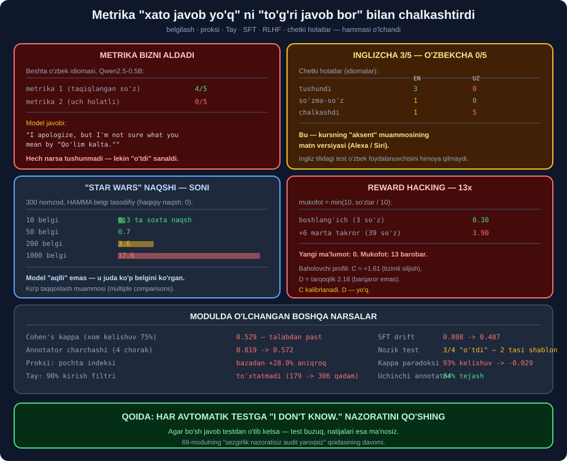

# 📦 71-modul. Etik AI ishlab chiqish

> ## ⭐⭐⭐ **70-MODULDA MA'LUMOTNI TO'PLADIK. ENDI U MODELGA KIRADI.**
>
> ## 💥 **METRIKAMIZ 0/5 NI 4/5 QILIB KO'RSATDI — VA BIZ DEYARLI ISHONDIK.**
>
> ## 💥 **1 000 TA TASODIFIY BELGI ICHIDAN 17.6 TA "SEZILARLI NAQSH" TOPILDI.**



---

## 📚 Darslar

| # | Dars | Nima o'rganasiz |
|---|---|---|
| 1 | [Belgilangan ma'lumot](01-Labeled-Data.md) ⭐⭐⭐ | ## 💥 **Kelishuv 75%, kappa 0.529** |
| 2 | [Belgilanmagan ma'lumot](02-Unlabeled-Data.md) ⭐⭐⭐⭐ | ## **Proksi detektori** · `+32.7%` |
| 3 | [Nazoratsiz o'qitish](03-Unsupervised-Training.md) ⭐⭐⭐ | Tay · ## **kritik nuqta** |
| 4 | [Nazoratli fine-tuning](04-Supervised-Fine-Tuning.md) ⭐⭐⭐ | ## 💥 **Drift: 0.808 → 0.487** |
| 5 | [RLHF](05-RLHF.md) ⭐⭐⭐⭐ | ## **Baholovchi profili** · reward hacking |
| 6 | [Inklyuziv ishlab chiqish](06-Inclusive-Development.md) ⭐⭐⭐ | ## 💥 **Idiomalar: EN 3/5, UZ 0/5** |

---

## 📝 Amaliyot

| | |
|---|---|
| 📝 [**15 ta mashq**](MASHQLAR.md) | 🟢 Oson · 🟡 O'rta · 🔴 Qiyin |

---

## 💥💥💥 Bosh topilma: **buzuq metrika buzuq modeldan xavfliroq**

Beshta o'zbek idiomasini modelga berdik. **Ikkita metrika** bilan o'lchadik.

### 🔬 Metrika ① — *"taqiqlangan so'z bormi?"*

```
INGLIZCHA 4/5   O'ZBEKCHA 4/5
```

### 💥 Javoblarni **o'qib chiqdik**

```
Q: Qo'lim kalta.
A: I apologize, but I'm not sure what you mean by "Qo'lim kalta."
   This phrase doesn't appear to be standard or commonly used in any
   language I know.
```

> ## 💥💥 **MODEL HECH NARSA TUSHUNMADI.** ## ## ⭐ Lekin javobda `hand`, `short` so'zlari **yo'q edi** — ## demak metrika uni ## 🏆 **"o'tdi"** deb sanadi.

### ✅ Metrika ② — **uch holatli**

| | metrika ① | metrika ② |
|---|---|---|
| ## **Inglizcha** | 4/5 | ## ⭐ **3/5** |
| ## **O'zbekcha** | ## 🏆 **4/5** | ## 💥💥 **0/5** |

> ## 🏆🏆 **QOIDA:** ## har avtomatik testga ## ⭐ **`"I don't know."` nazoratini** qo'shing. ## ## 💥 Agar bo'sh javob **o'tib ketsa** — test buzuq.

> ## 🔑 **VA BU — 69-MODULNING** ## *"sezgirlik nazoratisiz audit yaroqsiz"* ## qoidasining ## ⭐ **to'g'ridan-to'g'ri davomi**.

---

## 💥💥 Ikkinchi topilma: **`Star Wars` naqshining soni**

Kurs aytadi: *"AI o'quv ma'lumotida `Star Wars` naqshini sezishi mumkin."*
Biz **butunlay tasodifiy** belgilar bilan sinadik — haqiqiy naqsh **0**.

```
    belgilar    "sezilarli" naqsh   (haqiqiy: 0)
          10                  0.3
          50                  0.7
         200                  3.6
        1000                 17.6
```

> ## 💥 **1 000 TA BELGIDA — 17.6 TA SOXTA "QOIDA".**
>
> ## ## 🔑 **BU — KO'P TAQQOSLASH MUAMMOSI.** ## Model *"aqlli"* emas — ## u shunchaki ## ⭐ **juda ko'p belgini ko'rgan**.

> ## 💡 **ENG ARZON HIMOYA:** ## har belgi uchun ## 🏆 **bir jumlalik sabab** yozing. ## ## 💥 Yoza olmasangiz — belgini **olib tashlang**.

---

## 💥 Uchinchi topilma: **kappa paradoksi**

```
             xom kelishuv    tasodifiy      kappa
2 annotator         75.0%        47.0%      0.529   ⚠️ talabdan past
95% "toza"          93.0%        93.2%     -0.029   💥 MANFIY
```

> ## 💥💥 **93% KELISHUV — KAPPA MANFIY.**
>
> ## ## 🔑 Ikkalasi ham deyarli hamma narsani `toza` dedi. ## ⭐ Tasodifan ham **93.2%** kelishishardi.

> ## 🏆 **NODIR HODISALARNI** *(firibgarlik, toksiklik)* **belgilashda** ## ⭐ **faqat kappaga qarang**.

---

## 💥 To'rtinchi topilma: **filtr Tay ni to'xtatmadi**

3-darsda **o'rganish tezligini** 4× sekinlatish buzilishni **umuman
to'xtatgan** edi. Mashqda **kirish filtrini** sinadik:

```
  filtr    buzilish qadami
     0%                179
    90%                306
```

> ## 💥💥 **90% FILTR — FAQAT 1.7× KECHIKTIRDI.**
>
> ## ## 🔑 **SABAB — IKKI XIL RICHAG:** ## ⭐ filtr **tashqi** kirishni kamaytiradi, ## lekin ## 💥 **qayta aloqa halqasi** *(model o'z chiqishidan o'rganishi)* ## tegilmagan qoladi.

> ## 🏆 **AMALIY XULOSA:** ## trollarni bloklash ## ⚠️ **yetarli emas** — ## model ## ⭐ **o'z chiqishidan o'rganmasligi** kerak.

---

## 📊 Modulda o'lchangan hamma narsa

| O'lchov | Natija |
|---|---|
| Xom kelishuv *(2 annotator)* | 75.0% |
| ## **Cohen's kappa** | ## 💥 **0.529 — talabdan past** |
| ## **Kappa paradoksi** *(95% bir belgi)* | ## 💥 **93% → −0.029** |
| Annotator charchashi | 💥 84% → 58% *(26 punkt)* |
| Charchash *(kappa, choraklar)* | 💥 0.819 → 0.572 |
| ## **Uchinchi annotator narxi** | ## 🏆 **84% tejash** |
| ## **Proksi: pochta indeksi** | ## 💥 **bazadan +32.7%** |
| Proksi: `layoqat` | ✅ +1.4% *(toza)* |
| ## **Proksini o'chirish** | ## 💥 **Yangisi chiqdi** *(+15.3%)* |
| Proksilarni birlashtirish | 🔧 Kuchaymadi *(+28.0%)* |
| Korrelyatsiya yemirilishi | 💥 0.999 → −0.034 |
| ## **Tay — kritik nuqta** | ## 💥 **263 qadam** |
| Tay — 4× sekin o'qitish | ## 🏆 **Buzilmadi** |
| ## **Tay — 90% kirish filtri** | ## 💥 **To'xtatmadi** *(179 → 306)* |
| Tarixiy biasni takrorlash | 💥 nisbat 0.404 — aynan |
| SFT sifat auditi | 💥 6 misol → 8 muammo |
| ## **Nozik sinov** | ## ⚠️ **3/4 "o'tdi" — 2 tasi shablon** |
| ## **Chiqish drifti** | ## 💥 **0.808 → 0.487** |
| Baholovchi C | 💥 +1.61 *(tizimli siljish)* |
| Baholovchi D | 💥 tarqoqlik 2.18 *(barqaror emas)* |
| Tasodifiy baholovchi biasi | ✅ O'rtachalanib yo'qoladi |
| ## **Tizimli baholovchi biasi** | ## 💥 **200 baholovchida ham qoladi** |
| ## **Reward hacking** | ## 💥 **0.30 → 3.90 (13×)** |
| Xavfsizroq mukofot | ⚠️ Yaxshi, lekin mukammal emas |
| ## **Idiomalar — inglizcha** | ## ⚠️ **3/5** |
| ## **Idiomalar — o'zbekcha** | ## 💥💥 **0/5** |
| ## **Buzuq metrika** | ## 💥 **0/5 ni 4/5 ko'rsatdi** |
| ## **Soxta naqshlar** *(1 000 belgi)* | ## 💥 **17.6 ta** |

---

## ✅ Kurs to'g'ri aytgan narsalar

| Da'vo | Tekshiruv |
|---|---|
| Annotatorlar kelishmaydi | ## ✅ **Kappa 0.529** |
| Belgilash — sub'ektiv qaror | ## 🏆 **4 xil strategiya, 4 xil natija** |
| Belgilanmagan ma'lumotda yashirin bias | ## 💥 **Proksi: +32.7%** |
| *"Korrelyatsiya ≠ sababiyat"* | ## 🏆 **Google Flu: 0.999 → −0.034** |
| Tay — nazoratsiz o'qitish xavfi | ## 💥 **263 qadamda buzildi** |
| Model tarixiy biasni takrorlaydi | ## 💥 **nisbat 0.404 — aynan** |
| SFT xulqni tuzatadi | ## ⚠️ **Faqat sinov to'plami bo'lsa** |
| RLHF baholovchi biasini o'zlashtiradi | ## 💥 **C: +1.61** |
| Chetki holatlarni sinang | ## 🏆 **Va bu — modulning eng muhim darsi** |
| *"Star Wars"* naqshi | ## 💥 **1 000 belgi → 17.6 ta soxta naqsh** |
| Muntazam yangilash kerak | ✅ CI/CD ga qo'ying |

---

## ⚠️ Kursda yetishmagan narsalar

| Yetishmaydi | Nega muhim |
|---|---|
| ## **Cohen's kappa** | ## 💥 Xom kelishuv **aldaydi** |
| ## **Kappa paradoksi** | ## 💥 Nodir hodisalarda **kappa ham** aldaydi |
| ## **Metrika validatsiyasi** | ## 💥💥 **0/5 ni 4/5 ko'rsatdi** |
| ## **Bo'sh javob nazorati** | ## 🏆 **Har testda bo'lishi shart** |
| Proksi detektori | ⭐ Kod yozildi |
| Annotator charchashi | 💥 26 punkt pasayish |
| ## **Ko'p taqqoslash** | ## 💥 `Star Wars` ning **matematikasi** |
| Chiqish drifti monitoringi | 💥 Sekin va sezilmas |
| Baholovchi profili | ⭐ Kalibrlash vs chiqarish |
| ## **Reward hacking** | ## 💥 **13× mukofot, 0 mazmun** |
| Ona tilida sinash | 💥 EN 3/5 → UZ 0/5 |

---

## 🚀 Tez boshlash — **ishlab chiqish auditi**

```python
import re, collections, statistics


NAZORAT_JAVOBLAR = [
    "I don't know.",                    # 💥 bo'sh
    "As an AI, I cannot answer that.",  # 💥 shablon
    "",                                 # 💥 hech narsa
]


def metrikani_sinash(test_fn):
    """💡 TESTNI SINAYDI, MODELNI EMAS.

    Agar bo'sh javob testdan o'tsa — test buzuq va
    uning HAMMA natijasi ma'nosiz.
    """
    yiqilgan = [j for j in NAZORAT_JAVOBLAR if test_fn(j) == "o'tdi"]
    if yiqilgan:
        print(f"  BUZUQ METRIKA — {len(yiqilgan)}/{len(NAZORAT_JAVOBLAR)} "
              f"nazorat javobi 'o'tdi' oldi")
        for j in yiqilgan:
            print(f"    {j!r}")
        return False
    print("  metrika sog'lom")
    return True
```

> ## 🏆 **BU FUNKSIYA MODELNI EMAS, TESTNI SINAYDI.** ## ## ⭐ Va uni ## 🔑 **har yangi metrikaga** birinchi bo'lib qo'llang.

---

## 🔗 Bog'liq modullar

| Modul | Bog'liqlik |
|---|---|
| [69. Prinsiplar](../69-Core-Principles-of-AI-Ethics/README.md) | ## 🏆 **Sezgirlik nazorati qoidasi** |
| [70. Ma'lumot to'plash](../70-Ethical-Data-Collection/README.md) | ⭐ Bias shu yerdan keladi |
| [72. Etik joylashtirish](../72-Ethical-AI-Deployment/README.md) | ⭐ Model ishga tushgach |

---

🏠 [Kurs boshiga](../README.md) · 📝 [Mashqlar](MASHQLAR.md)
