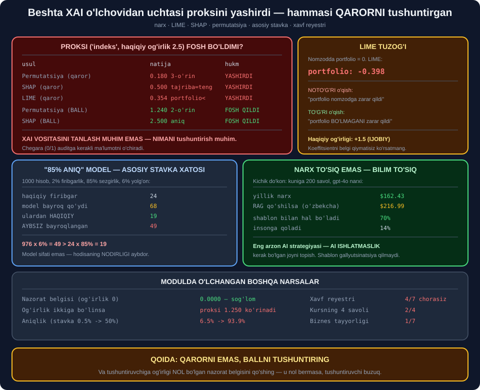

# 📦 73-modul. Biznes foydalanuvchilar uchun etik AI

> ## ⭐⭐⭐ **KURS LIME, SHAP VA PERMUTATSIYANI SANAB O'TADI. BIZ UCHALASINI YOZDIK.**
>
> ## 💥 **BESHTA O'LCHOVDAN UCHTASI PROKSINI YASHIRDI — VA UCHALASI HAM QARORNI TUSHUNTIRGAN EDI.**
>
> ## 💥 **"85% ANIQ" MODEL 68 TA BAYROQ QO'YDI — ULARDAN 49 TASI AYBSIZ.**



---

## 📚 Darslar

| # | Dars | Nima o'rganasiz |
|---|---|---|
| 1 | [Har o'lchamdagi biznes](01-Access-for-All-Sizes.md) ⭐⭐⭐ | ## 🏆 **70% savol AI siz hal bo'ladi** |
| 2 | [Shaffoflik va XAI](02-Transparency-and-XAI.md) ⭐⭐⭐⭐⭐ | ## 💥 **LIME · SHAP · permutatsiya — yozildi** |
| 3 | [Chiqishlardan etik foydalanish](03-Ethical-Use-of-Outputs.md) ⭐⭐⭐⭐ | ## 💥 **Aniqlik 27.9%** |
| 4 | [Mas'uliyatli joriy qilish](04-Responsible-Adoption.md) ⭐⭐⭐ | ## **Xavf reyestri** · 💥 4/7 chorasiz |

---

## 📝 Amaliyot

| | |
|---|---|
| 📝 [**12 ta mashq**](MASHQLAR.md) | 🟢 Oson · 🟡 O'rta · 🔴 Qiyin |

---

## 💥💥💥 Bosh topilma: **nimani tushuntirish — qaysi vosita emas**

Shaffof model qurdik, og'irliklarni **oldindan bildik**, keyin
uchala XAI usulini ham unga qo'lladik.

```python
HAQIQIY_OGIRLIK = {
    "tajriba":    3.0,
    "talim":      0.0,      # ⭐ model buni ISHLATMAYDI
    "sertifikat": 1.0,
    "indeks":     2.5,      # 💥 PROKSI — pochta indeksi
    "portfolio":  1.5,
}
```

### ✅ Proksi *(`indeks`, og'irlik 2.5)* fosh bo'ldimi?

| Usul | Natija | Hukm |
|---|---|---|
| Permutatsiya *(qaror)* | `0.180`, **3-o'rin** | ## 💥 **Yashirdi** |
| SHAP *(qaror)* | `0.500` — tajriba bilan **teng** | ## 💥 **Yashirdi** |
| LIME *(qaror)* | `0.354` — portfolio**dan past** | ## 💥 **Yashirdi** |
| ## **Permutatsiya (BALL)** | ## `1.240`, **2-o'rin** | ## ✅ **Fosh qildi** |
| ## **SHAP (BALL)** | ## `2.500` — **aniq** | ## 🏆 **Fosh qildi** |

> ## 🏆🏆 **UCHALA "YASHIRGAN" USULNING ## YAGONA UMUMIY JIHATI —** ## ## 💥 **ULAR QARORNI (0/1) TUSHUNTIRGAN.**

> ## 💡 **XAI VOSITASINI TANLASH MUHIM EMAS.** ## ## ⭐ **NIMANI tushuntirish muhim.**

### ⚠️ Va halol bo'laylik — bu *"xato siralash"* emas

```
  indeks vs portfolio: 0.1803 vs 0.1821   farq=+0.0018
  sd lar: 0.0119, 0.0111  ->  SHOVQIN ICHIDA
```

> ## 💥 **BU — DAHSHATLIROQ.** ## Permutatsiya ularni ## ⭐ **umuman ajrata olmaydi**, ## va auditor ## 🔑 *"indeks portfolio bilan bir xil"* ## degan xulosaga keladi.

---

## 💥💥 Ikkinchi topilma: **LIME ning `−0.398` tuzog'i**

```
  belgi          LIME(qaror)   HAQIQIY og.
  portfolio           -0.398           1.5
```

Bu nomzodda `portfolio = 0`.

| O'qish | To'g'rimi |
|---|---|
| *"Portfolio nomzodga **zarar** qildi"* | ## 💥 **NOTO'G'RI** |
| ## *"Portfolio **BO'LMAGANI** zarar qildi"* | ## ✅ **To'g'ri** |

> ## 💥💥 **HR MENEJERI HISOBOTDA `−0.398` NI KO'RIB, ## BIRINCHISINI O'QIYDI.**

> ## 🏆 **YECHIM** *(9-mashq)*: ## koeffitsientni ## ⭐ **hech qachon yolg'iz ko'rsatmang** — ## har birini ## 🔑 **belgi qiymati bilan** yozing.

---

## 💥 Uchinchi topilma: **"85% aniq" — model xususiyati emas**

Kursning firibgarlik misolini o'lchadik:

```
  jami hisob:          1000
  haqiqiy firibgarlik:   24
  model bayroq qo'ydi:   68
  ulardan HAQIQIY:       19

  ANIQLIK: 27.9%
```

> ## 💥💥 **976 × 6% = 49  >  24 × 85% = 19.**
>
> ## ## 🔑 Aybsizlar shunchalik ko'pki, ## ularning **kichik foizi ham** ## ⭐ **haqiqiy holatlardan ko'p**.

Firibgarlik darajasini o'zgartirsak *(model o'zgarmaydi)*:

```
    daraja   aniqlik
      0.5%      6.5%
      2.0%     23.1%
     50.0%     93.9%
```

> ## 🏆 **SOTUVCHI "MODELIMIZ 85% ANIQ" DESA —** ## ## 💡 **SO'RANG: "QAYSI ASOSIY STAVKADA?"**

---

## 💥 To'rtinchi topilma: **savollarning 70% i AI talab qilmaydi**

```
  shablon bilan (AI SIZ) hal bo'ladi: 70%
  AI qo'shilsa jami:                  86%
  insonga qoladi:                     14%
```

> ## 🔑 **VA SHABLON — FAQAT ARZON EMAS:**
>
> ## | | AI | Shablon | ## |---|---|---| ## | Gallyutsinatsiya | 💥 7/8 | ## ✅ **Yo'q** | ## | Nomuvofiqlik | 💥 37.5% | ## ✅ **Yo'q** | ## | Tushuntirish | ⚠️ Qiyin | ## 🏆 **Ko'rinadigan qoida** |

> ## 🏆🏆 **ENG ARZON AI STRATEGIYASI —** ## ## ⭐ **AI ISHLATMASLIK KERAK BO'LGAN JOYNI TOPISH.**

---

## 📊 Modulda o'lchangan hamma narsa

| O'lchov | Natija |
|---|---|
| Kichik do'kon yillik narxi | ## 🏆 **$162.43** |
| Til jarimasi *(qisqa savol + tizim)* | ⭐ `1.01x` |
| ## **Til jarimasi (RAG hujjati)** | ## 💥 **`1.57x`, yiliga +$47** |
| Til jarimasi *(boshqa matn)* | 💥 `2.60x` |
| ## **Shablon bilan hal bo'ladi** | ## 🏆 **70%** |
| Insonga qoladi | 14% |
| ## **Permutatsiya (qaror): indeks** | ## 💥 **3-o'rin, shovqin ichida** |
| ## **Permutatsiya (ball): indeks** | ## ✅ **2-o'rin, aniq** |
| Permutatsiya *(ball)* siralashi | ## 🏆 **Aynan to'g'ri** |
| ## **SHAP (qaror)** | ## 💥 **0.500 / 0.500** |
| ## **SHAP (ball)** | ## 🏆 **3.000 / 2.500 — aniq** |
| LIME `portfolio` | 💥 `−0.398` *(haqiqiy `+1.5`)* |
| Nazorat belgisi *(og'irlik 0)* | ## ✅ **0.0000** |
| ## **Og'irlik ikkiga bo'linsa** | ## 💥 **Proksi `1.250` ko'rinadi** |
| SHAP *(qaror)*, chegara `6.0` | 💥 Hammasi `0.000` |
| ## **Firibgarlik aniqligi** | ## 💥 **27.9%** |
| Aybsiz bayroqlangan | 💥 49/68 |
| ## **Aniqlik (stavka 0.5% → 50%)** | ## 💥 **6.5% → 93.9%** |
| Inson quvvati 60 | ⚠️ 4 ta aybsiz yopiladi |
| Inson vaqti aybsizlarga | 💥 72% |
| Kursning 4 savoli | 💥 **2/4** |
| ## **Xavf reyestri** | ## 💥 **4/7 chorasiz, ball 71** |
| Operatsion xavf jami | 💥 51 *(uchalasi ham chorasiz)* |
| ## **Biznes tayyorligi** | ## 💥 **1/7** |

---

## ✅ Kurs to'g'ri aytgan narsalar

| Da'vo | Tekshiruv |
|---|---|
| AI narxi to'siq bo'lmasligi kerak | ## 🏆 **$162/yil** |
| Bepul vositalar bor | ## ✅ **Bu kitobning o'zi — isbot** |
| ## *"Kichikdan boshlang"* | ## 🏆 **70% shablon bilan** |
| AI ni *"moda uchun"* joriy qilmang | ## ✅ **6 tadan 2 tasi** |
| Qora quti muammosi haqiqiy | ✅ 72-modul |
| ## **Permutatsiya muhimligi** | ## ✅ **Ballda ishlaydi** |
| ## **SHAP lokal va global** | ## 🏆 **Ballda AYNAN to'g'ri** |
| LIME kiritmani o'zgartiradi | ## ⚠️ **Lekin belgisi chalg'itadi** |
| AI chiqishi — javob emas, taklif | ## 💥 **27.9% aniqlik** |
| Inson nazorati kerak | ## ⚠️ **Quvvat yetmasa — qisman himoya** |
| Uchta xavf toifasi | ## ✅ **Reyestr qurildi** |

---

## ⚠️ Kursda yetishmagan narsalar

| Yetishmaydi | Nega muhim |
|---|---|
| ## **BALL vs QAROR farqi** | ## 💥💥 **Modulning bosh topilmasi** |
| ## **Nazorat belgisi** | ## 🏆 **Tushuntiruvchini sinash** |
| LIME belgisini o'qish | 💥 `−0.398` teskari o'qiladi |
| Og'irlikni bo'lib yashirish | 💥 Proksi `1.250` ko'rinadi |
| ## **Asosiy stavka xatosi** | ## 💥💥 **"85% aniq" ma'nosiz** |
| Inson quvvatini hisoblash | 💥 Vaqtning 72% i aybsizlarga |
| ## **Qaytarish yo'li** | ## 🏆 **Eng ko'p unutiladigan savol** |
| Xavf reyestrini testga aylantirish | ⭐ `AssertionError` |

---

## 🚀 Tez boshlash — **tushuntiruvchini sinash**

```python
def tushuntiruvchini_sinash(tushuntir_fn, yozuvlar, belgilar):
    """💡 MODELNI emas, TUSHUNTIRUVCHINI sinaydi.

    Butunlay tasodifiy belgi qo'shamiz. Uning og'irligi — NOL.
    Tushuntiruvchi unga nol bermasa, u BUZUQ.
    """
    r = random.Random(0)
    kengaytirilgan = [{**x, "__nazorat__": (1 if r.random() < 0.5 else 0)}
                      for x in yozuvlar]

    natija = tushuntir_fn(kengaytirilgan, belgilar + ["__nazorat__"])
    n = abs(natija["__nazorat__"])

    if n > 0.01:
        raise AssertionError(
            f"BUZUQ TUSHUNTIRUVCHI: nazorat belgisiga {n:.4f} berdi")
    print(f"  tushuntiruvchi sog'lom (nazorat: {n:.4f})")
```

> ## 🏆 **BIZDA `talim` VA `__nazorat__` — ## IKKALASIGA HAM `0.0000` BERILDI.**

> ## 💡 **BIR QATOR KOD — ## VA U BUTUN AUDITNI HAQIQIY QILADI.**

---

## 🔗 Bog'liq modullar

| Modul | Bog'liqlik |
|---|---|
| [71. Ishlab chiqish](../71-Ethical-AI-Development/README.md) | ## ⭐ **Proksi shu yerdan keldi** |
| [72. Joylashtirish](../72-Ethical-AI-Deployment/README.md) | ## 🏆 **Reliz testi** |
| [74. Shaxslar uchun](../74-Ethical-AI-for-Individuals/README.md) | ⭐ Boshqa tomondan qarash |
| [76. Regulyatsiya](../76-Data-and-AI-Regulatory-Frameworks/README.md) | ⭐ Tushuntirish — huquqiy talab |

---

🏠 [Kurs boshiga](../README.md) · 📝 [Mashqlar](MASHQLAR.md)
