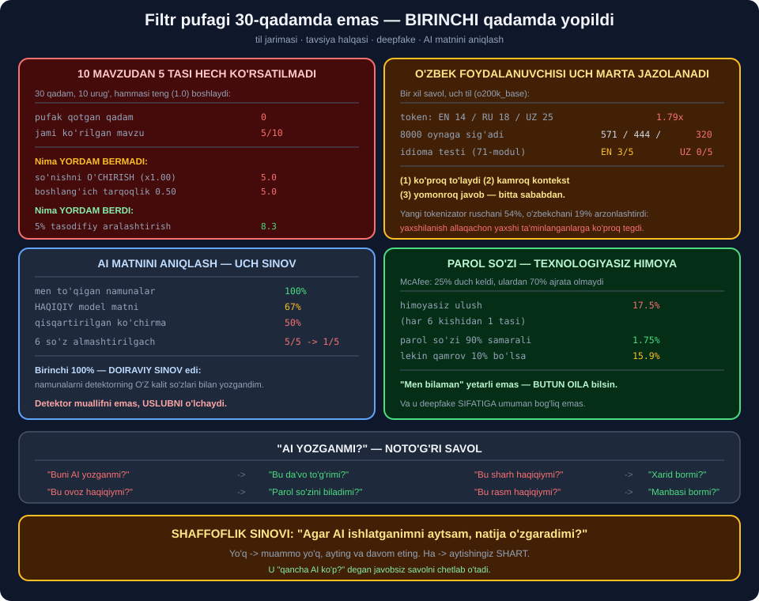

# 📦 74-modul. Shaxsiy foydalanuvchilar uchun etik AI

> ## ⭐⭐⭐ **73-MODUL BIZNESGA QARADI. BU MODUL — SIZGA.**
>
> ## 💥 **FILTR PUFAGI BIRINCHI QADAMDA YOPILDI — SO'NISHNI O'CHIRSAK HAM.**
>
> ## 💥 **AI DETEKTORIM 100% BERDI. KEYIN BILDIMKI, TESTNI O'ZIM UNGA MOSLAB YOZGANMAN.**



---

## 📚 Darslar

| # | Dars | Nima o'rganasiz |
|---|---|---|
| 1 | [AI ga teng kirish](01-Equity-in-Access.md) ⭐⭐⭐⭐ | ## 💥 **O'zbekcha `1.79x` token, `320` vs `571`** |
| 2 | [Inson–AI hamkorligi](02-Human-AI-Collaboration.md) ⭐⭐⭐⭐ | ## 💥 **Pufak `0`-qadamda yopiladi** |
| 3 | [Mas'uliyatli foydalanish](03-Responsible-Use.md) ⭐⭐⭐⭐ | ## 💥 **Detektor: `100%` → `67%` → `50%`** |

---

## 📝 Amaliyot

| | |
|---|---|
| 📝 [**10 ta mashq**](MASHQLAR.md) | 🟢 Oson · 🟡 O'rta · 🔴 Qiyin |

---

## 💥💥💥 Bosh topilma: **pufakni so'nish emas, `top-k` yaratadi**

Tavsiya halqasini modellashtirdik: 10 ta mavzu, hammasi **teng** boshlaydi.

```
   urug   pufak qotgan qadam    jami korilgan mavzu
      0                    0                   5/10
      1                    0                   5/10
      ...                                      5/10

  o'rtacha: 0.0-qadamda pufak QOTADI (30 qadamdan)
```

> ## 💥 **BIRINCHI QADAMDAYOQ.** ## 10 ta urug'ning **hammasida**.

### 🔬 Sababni izladik — **uchta gipoteza sinaldi**

| O'zgartirdik | Natija |
|---|---|
| So'nishni **butunlay o'chirdik** *(×1.00)* | ## 💥 **Hamon `5.0`** |
| Boshlang'ich qiziqishga **tarqoqlik** | ## 💥 **Hamon `5.0`** |
| `k` ni o'zgartirdik | ## ⭐ **Aynan `k` ta** |
| ## **`5%` tasodifiy aralashtirish** | ## 🏆 **`5.0` → `8.3`** |

> ## 🔧 **MEN SO'NISH AYBDOR DEB O'YLAGAN EDIM.** ## ## 💥 **U EMAS.**

> ## 🔑 **HAQIQIY SABAB — `top-k` NING O'ZI.** ## ## ⭐ Tizim **har doim eng yuqori 5 tasini** bersa, ## qolgan 5 tasi ## 💥 **hech qachon ko'tarila olmaydi** — ## ular **so'nmasa ham**.

> ## 🏆🏆 **YAGONA ISHLAYDIGAN CHORA — ## ATAYIN QILINGAN TASODIF.** ## ## 💡 Va u ## ⭐ **20 ta tavsiyadan 1 tasi** bo'lsa yetarli.

---

## 💥💥 Ikkinchi topilma: **detektorimni o'zim aldadim**

AI matnini aniqlaydigan sodda detektor yozdim.

| Sinov | Aniqlik |
|---|---|
| ## **Men to'qigan namunalar** | ## 🏆 **100%** |
| ## **HAQIQIY model matni** | ## ⚠️ **67%** |
| Qisqartirilgan ko'chirmalar | ## 💥 **50%** *(doimiy javob)* |
| 6 ta so'z almashtirilgach | ## 💥 **`5/5` → `1/5`** |

> ## 💥💥💥 **BIRINCHI `100%` — DOIRAVIY SINOV EDI.**
>
> ## ## 🔑 Men *"AI namunalarini"* ## ⭐ **detektorning O'Z kalit so'zlari** bilan yozgandim.

> ## 🏆 **VA UCHINCHI QATOR — 72-MODULNING ## `AI SUDYA` MUAMMOSI QAYTA:** ## ## ⭐ **50% aniqlik + doimiy javob = buzuq.**

> ## 💡 **XULOSA:** ## kalit so'z detektori ## ⭐ **muallifni emas, USLUBNI** o'lchaydi — ## va uslubni ## 💥 **bir daqiqada** o'zgartirish mumkin.

---

## 💥 Uchinchi topilma: **o'zbek foydalanuvchisi uch marta jazolanadi**

```
  til            belgi   token   nisbat
  inglizcha         64      14    1.00x
  ruscha            73      18    1.29x
  o'zbekcha         79      25    1.79x

  8000 tokenlik oynaga sig'adi:
  inglizcha  571 ta    ruscha  444 ta    o'zbekcha  320 ta
```

| # | Jazo | O'lchov |
|---|---|---|
| ① | ## **Ko'proq to'laydi** | `1.79x` token |
| ② | ## **Kamroq kontekst** | `571` → `320` |
| ③ | ## **Yomonroq javob** | ## 💥 **idiomalar `3/5` → `0/5`** *(71-modul)* |

> ## 🔑 **UCHALASI HAM BITTA SABABDAN:** ## ## ⭐ **o'quv ma'lumotida o'zbek tili kam.**

### 💥 Va yangi tokenizator buni **tuzatmadi**

```
  til            cl100k    o200k   yaxshilanish
  ruscha             39       18            54%
  o'zbekcha          31       25            19%
```

> ## 💥💥 **RUSCHA 54%, O'ZBEKCHA 19%.**
>
> ## ## 🔑 Texnik yaxshilanishlar ## ⭐ **allaqachon yaxshi ta'minlangan** tillarga ## 💥 **ko'proq foyda** keltiradi.

> ## ⚠️ **HALOL ESLATMA** *(2-mashq)*: ## haqiqiy suhbatda farq **kichikroq** — ## `37` va `35` navbat, ## chunki ## ⭐ **javob tokenlari hukmron**. ## ## 💥 Lekin javob ham o'zbekcha bo'lsa — **farq qaytadi**.

---

## 📊 Modulda o'lchangan hamma narsa

| O'lchov | Natija |
|---|---|
| ## **Token nisbati (o'zbekcha)** | ## 💥 **`1.79x`** |
| Token nisbati *(ruscha)* | `1.29x` |
| ## **8000 oynaga sig'adigan savol** | ## 💥 **571 / 444 / 320** |
| Suhbat navbatlari *(javob bilan)* | 🔧 37 / 36 / 35 |
| ## **Tokenizator yaxshilanishi** | ## 💥 **RU 54%, UZ 19%** |
| ## **Pufak qotgan qadam** | ## 💥 **0** *(10/10 urug')* |
| Jami ko'rilgan mavzu | 💥 **5/10** |
| So'nish o'chirilsa | 💥 Hamon 5.0 |
| Boshlang'ich tarqoqlik `0.50` | 💥 Hamon 5.0 |
| ## **5% tasodif** | ## 🏆 **5.0 → 8.3** |
| 25% tasodif | 9.9 |
| `top-3` ulushi *(pufakda)* | 74.9%–77.1% |
| ## **Detektor (o'z namunalarim)** | ## 🔧 **100% — doiraviy** |
| ## **Detektor (haqiqiy model)** | ## ⚠️ **67%, 2/6** |
| Detektor *(qisqartma)* | 💥 50%, **doimiy javob** |
| ## **6 so'z almashtirilgach** | ## 💥 **5/5 → 1/5** |
| Uzunlik detektori | 💥 **100% — va soxta** |
| McAfee: himoyasiz ulush | 💥 **17.5%** *(har 6 dan 1)* |
| ## **Parol so'zi (90% samara)** | ## 🏆 **17.5% → 1.75%** |
| Parol so'zi *(10% qamrov)* | ⚠️ 15.9% |

---

## ✅ Kurs to'g'ri aytgan narsalar

| Da'vo | Tekshiruv |
|---|---|
| Teng kirish muammosi haqiqiy | ## 💥 **`1.79x`, `320` vs `571`** |
| ## **Filtr pufagi** | ## 💥 **0-qadamda yopiladi** |
| AI *"neytral emas"* | ## ✅ **Butun kitob shu haqda** |
| AI matni odamnikidan farqsiz | ## 💥 **Detektor 67%** |
| Deepfake — real xavf | ## 💥 **17.5% himoyasiz** |
| McAfee: 25% / 70% | ## ⚠️ **Manba tekshirilmadi** |
| Tanqidiy fikrlash kerak | ## 🏆 **Va u — savolni O'ZGARTIRISH** |

---

## ⚠️ Kursda yetishmagan narsalar

| Yetishmaydi | Nega muhim |
|---|---|
| ## **TIL to'sig'i** | ## 💥💥 **Kursning 3 yechimi ham tilga tegmaydi** |
| Kontekst oynasi tengsizligi | 💥 `320` vs `571` |
| ## **Pufakning MEXANIZMI** | ## 🔑 **`top-k`, so'nish emas** |
| Tasodifiy aralashtirish | 🏆 `5%` yetarli |
| ## **Detektorlar ishlamasligi** | ## 💥 **6 so'z — `5/5` → `1/5`** |
| ## **Parol so'zi** | ## 🏆 **Eng arzon himoya** |
| Shaffoflik sinovi | ⭐ Bitta savol |

---

## 🚀 Tez boshlash — **o'z lentangizni tekshiring**

```python
import collections


def lenta_auditi(korilgan_manbalar, jami_manbalar, chegara=0.60):
    """💡 Lentangizdagi oxirgi 50 ta postning MANBASINI sanang."""
    s = collections.Counter(korilgan_manbalar)
    top3 = sum(v for _, v in s.most_common(3)) / len(korilgan_manbalar)

    return {
        "xilma_xillik": f"{len(s)}/{jami_manbalar}",
        "top_3_ulushi": f"{top3:.0%}",
        "hukm": "PUFAK" if top3 > chegara else "ochiq",
    }
```

> ## 🔑 **CHEGARA `60%` — MODELIMIZDAN OLINDI:** ## pufak yopilganda `top-3` ulushi ## ⭐ **74.9%–77.1%** edi.

> ## 💡 **VA BU — QO'LDA BAJARILADI.** ## ## 🏆 Kod yozishning hojati yo'q: ## ⭐ oxirgi **50 ta postni** sanang.

---

## 🔗 Bog'liq modullar

| Modul | Bog'liqlik |
|---|---|
| [71. Ishlab chiqish](../71-Ethical-AI-Development/README.md) | ## ⭐ **Idioma testi shu yerdan** |
| [72. Joylashtirish](../72-Ethical-AI-Deployment/README.md) | ## 🏆 **Doimiy javob = buzuq** |
| [73. Biznes uchun](../73-Ethical-AI-for-Businesses/README.md) | ⭐ Boshqa tomondan qarash |
| [75. ChatGPT etikasi](../75-ChatGPT-Ethics/README.md) | ⭐ Aniq vosita misolida |

---

🏠 [Kurs boshiga](../README.md) · 📝 [Mashqlar](MASHQLAR.md)
