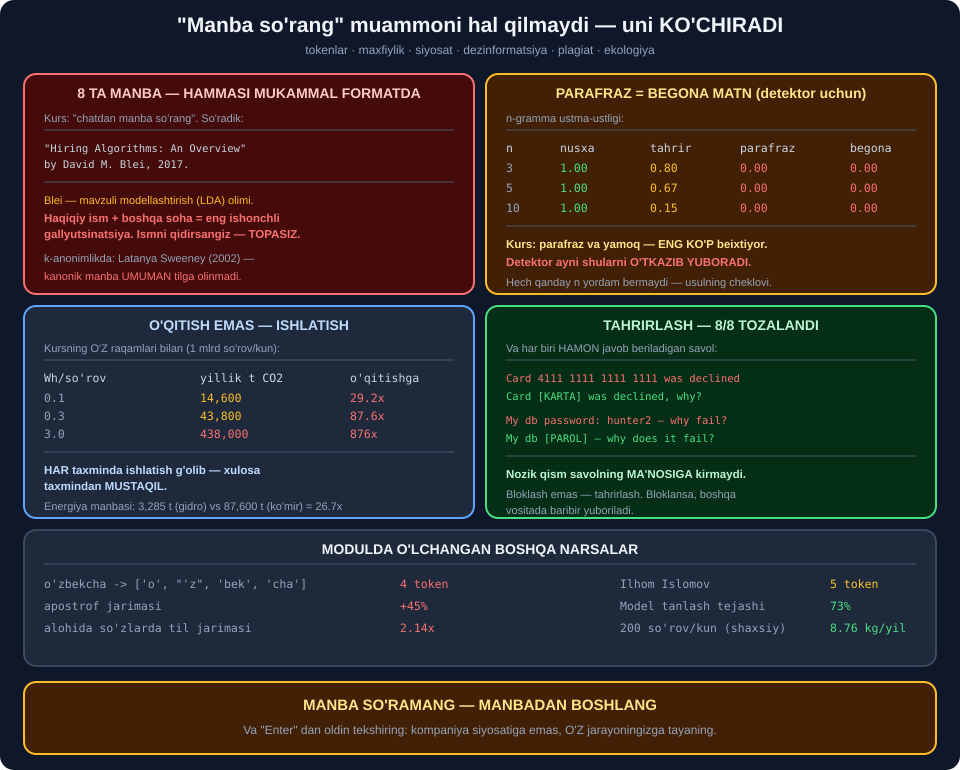

# 📦 75-modul. ChatGPT etikasi

> ## ⭐⭐⭐ **68–74-MODULLARDAGI HAMMA NARSA — BITTA ANIQ VOSITAGA QO'LLANADI.**
>
> ## 💥 **KURS "MANBA SO'RANG" DEYDI. SO'RADIK — 8 TA MANBA OLDIK, VA HECH BIRINI TEKSHIRA OLMADIM.**
>
> ## 💥 **PARAFRAZ PLAGIATI DETEKTOR UCHUN BUTUNLAY BEGONA MATNDAN FARQ QILMAYDI.**



---

## 📚 Darslar

| # | Dars | Nima o'rganasiz |
|---|---|---|
| 1 | [ChatGPT ni tushunish](01-Understanding-ChatGPT.md) ⭐⭐⭐ | ## **Tokenlar** · 💥 `o'zbekcha` = 4 token |
| 2 | [Maxfiylik](02-Privacy-Concerns.md) ⭐⭐⭐⭐ | ## 🏆 **Tahrirlovchi: 8/8** |
| 3 | [OpenAI siyosatlari](03-OpenAI-Policies.md) ⭐⭐⭐ | ## 💥 **3 sozlama standart YOQILGAN** |
| 4 | [Dezinformatsiya](04-Misinformation.md) ⭐⭐⭐⭐⭐ | ## 💥 **8 ta manba, 0 ta tekshirilgan** |
| 5 | [Plagiat](05-Plagiarism.md) ⭐⭐⭐⭐ | ## 💥 **Parafraz — hamma `n` da `0.00`** |
| 6 | [Atrof-muhit](06-Environment.md) ⭐⭐⭐ | ## 💥 **Ishlatish o'qitishdan `29–876x`** |

---

## 📝 Amaliyot

| | |
|---|---|
| 📝 [**10 ta mashq**](MASHQLAR.md) | 🟢 Oson · 🟡 O'rta · 🔴 Qiyin |

---

## 💥💥💥 Bosh topilma: *"manba so'rang"* — **muammoni ko'chiradi**

Kursning maslahatini sinadik. Model **8 ta manba** berdi —
muallif, yil, sarlavha, **mukammal format**.

```
1. "Hiring Algorithms: An Overview" by David M. Blei, 2017.
```

> ## 🔑 **Blei — mavzuli modellashtirish *(LDA)* olimi.** ## Yollash algoritmlari — ## 💥 **uning sohasi emas**.

> ## 🏆 **HAQIQIY ISM + MAVJUD BO'LMAGAN ISH —** ## gallyutsinatsiyaning ## ⭐ **eng ishonchli ko'rinishi**, ## chunki ismni ## 💡 **qidirsangiz topasiz**.

### 💥 Va `k`-anonimlik so'ralganda

Kanonik manba — **Latanya Sweeney (2002)**.

> ## 💥💥 **MODEL UNI UMUMAN TILGA OLMADI.**

### ⚠️ Eng muhim qism — **halol e'tirof**

> ## ⚠️ **MEN BU 8 TA MANBANI TEKSHIRA OLMADIM.** ## Bu kitob ## ⭐ **internetsiz** yozildi.

> ## 🏆🏆 **VA MANA SHU — XULOSANING O'ZI:**

| Nima | Narxi |
|---|---|
| Manba **so'rash** | ⭐ 5 soniya |
| Manba **yaratish** | ⭐ Model uchun **bepul** |
| ## **TEKSHIRISH** | ## 💥 **Har biri uchun daqiqalar** |

> ## 💥 **TEKSHIRMASANGIZ — AHVOL YOMONLASHDI,** ## chunki manbali matn ## ⭐ **ishonchliroq ko'rinadi**.

> ## 💡💡 **TO'G'RI QOIDA:** ## ⭐ **manba so'ramang — MANBADAN boshlang** ## *(RAG, 62–64-modullar)*.

---

## 💥💥 Ikkinchi topilma: **parafraz = begona matn**

```
    n     so'zma-so'z   kichik tahrir        parafraz        mustaqil
    3            1.00            0.80            0.00            0.00
    5            1.00            0.67            0.00            0.00
   10            1.00            0.15            0.00            0.00
```

> ## 💥 **`parafraz` va `mustaqil` — ## ⭐ HAMMA `n` DA BIR XIL: `0.00`.**

| Kursning turi | Detektor topadimi |
|---|---|
| Global *(aynan nusxa)* | ## ✅ **Ha** |
| ## **Parafraz** | ## 💥 **Yo'q** |
| ## **Yamoq** | ## 💥 **Deyarli yo'q** |

> ## 🔑 **VA KURS AYNAN SHU IKKITASINI ## "ENG KO'P BEIXTIYOR" DEYDI.**
>
> ## ## 💥 Detektor **eng kam uchraydiganini** topadi.

---

## 💥 Uchinchi topilma: **o'qitish emas, ISHLATISH**

Kurs GPT-3 o'qitishga urg'u beradi *(500 t CO₂)*.
Uning **o'z raqamlari** bilan hisobladik:

```
   Wh/sorov   yillik t CO2   o'qitishga nisbatan
        0.1         14,600                 29.2x
        0.3         43,800                 87.6x
        3.0        438,000                876.0x
```

> ## 🏆🏆 **HAR TAXMINDA — ISHLATISH G'OLIB.**
>
> ## ## 🔑 Xulosa ## ⭐ **taxmindan MUSTAQIL** — ## va shuning uchun unga **ishonish mumkin**.

> ## ⚠️ **HALOL ESLATMA:** ## `0.3 Wh` va `400 g/kWh` — ## 💥 **men o'lchamagan** ochiq baholar. ## ## ⭐ **Kattalik tartibi** muhim, aniq son emas.

### 🏆 Va kursning eng yaxshi fikri

```
    Shvetsariya (gidro)   30 g/kWh -> yiliga  3,285 t
    Ko'mirga tayangan    800 g/kWh -> yiliga 87,600 t
```

> ## 💥 **26.7 BAROBAR — ## ⭐ BIR XIL MODEL, BIR XIL SO'ROVLAR.**

---

## 📊 Modulda o'lchangan hamma narsa

| O'lchov | Natija |
|---|---|
| ## **`o'zbekcha` bo'linishi** | ## 💥 **`['o', "'z", 'bek', 'cha']`** |
| `Toshkent` / `Tashkent` | 3 token |
| ## **Alohida so'zlarda til jarimasi** | ## 💥 **UZ `2.14x`, RU `2.00x`** |
| ## **Apostrof jarimasi** | ## 💥 **+45%** |
| `Ilhom Islomov` | 5 token |
| `G'ulom` | 💥 4 token *(apostrof yolg'iz)* |
| Nozik so'rovlar *(mening to'plamim)* | ⚠️ 8/18 — **o'lchov emas** |
| ## **Tahrirlovchi** | ## 🏆 **8/8 tozalandi** |
| Tahrirlovchi o'tkazgani | 💥 `roadmap-2026` |
| ## **Nazorat misollari** | ## ⚠️ **10/10 — 3 ta yolg'on bayroq** |
| Standart yoqilgan sozlamalar | 💥 **3/4** |
| *"Serverda qoladimi?"* | 💥 **Hamma rejimda ha** |
| ## **Manbalar berildi** | ## 💥 **8 ta** |
| ## **Manbalar tekshirildi** | ## 💥 **0 ta** |
| `k`-anonimlik kanonik manbasi | 💥 **Tilga olinmadi** |
| ## **Plagiat: parafraz** | ## 💥 **`0.00` — hamma `n` da** |
| Plagiat: kichik tahrir | ⚠️ `0.86` → `0.15` |
| AI detektorlari *(74-modul)* | 💥 67% / 50% |
| ## **O'qitish: 500 t** | ## `2.6 mln mil` |
| ## **Yillik ishlatish** | ## 💥 **`29–876x`** |
| Energiya manbasi farqi | 💥 **26.7x** |
| Shaxsiy iz *(200 so'rov/kun)* | ⭐ `8.76 kg/yil` |
| ## **Model tanlash tejashi** | ## 🏆 **73%** |

---

## ✅ Kurs to'g'ri aytgan narsalar

| Da'vo | Tekshiruv |
|---|---|
| ## **Token — so'z, qism yoki belgi** | ## ✅ **Uchalasi ham ko'rindi** |
| Model naqshlarni o'rganadi | ## ✅ **72-modul: mango** |
| ChatGPT — orakul emas | ## ✅ **Butun kitob** |
| Alohida promptni o'chirib bo'lmaydi | ## 💥 **Shuning uchun "Enter" dan oldin** |
| Xodimlar nozik ma'lumot kiritadi | ## ⚠️ **Kursning 11% i tekshirilmadi** |
| Xotira — tarixdan boshqa narsa | ## ✅ **Alohida o'chiriladi** |
| Vaqtinchalik suhbat foydali | ## ✅ **Lekin serverga baribir boradi** |
| ## **Manbalarni tekshiring** | ## 🏆 **Va bu QIMMAT** |
| Detektorlar cheklangan | ## 💥 **Kursda aytilganidan yomonroq** |
| ## **"Yangi turdagi tengsizlik"** | ## 💥 **74-modul: uzunlik detektori** |
| Taqiq — yechim emas | ## ✅ **Jarayon kerak** |
| ## **Energiya MANBASI muhim** | ## 🏆 **26.7x — kursning eng yaxshi fikri** |
| *"1 mln mildan ortiq"* | ## ✅ **Bizda 2.6 mln** |

---

## ⚠️ Kursda yetishmagan narsalar

| Yetishmaydi | Nega muhim |
|---|---|
| ## **Manba so'rash MUAMMONI KO'CHIRADI** | ## 💥💥 **8 ta tekshirilmagan da'vo** |
| Apostrof narxi | 💥 +45% |
| ## **Tahrirlash (bloklash emas)** | ## 🏆 **8/8 va ma'no saqlandi** |
| Nazorat misollari | ⚠️ 3/10 yolg'on bayroq |
| ## **Parafraz topilmasligi** | ## 💥 **Usulning cheklovi** |
| ## **Ishlatish > o'qitish** | ## 💥 **29–876x** |
| Shaxsiy iz ahamiyatsizligi | ⚠️ Halol aytish kerak |
| Model tanlash | 🏆 73% tejash |

---

## 🚀 Tez boshlash — **`Enter` dan oldingi tekshiruv**

```python
def xavfsiz_yuborish(matn, enc, oyna=8000):
    """💡 Uch tekshiruv — HAR chaqiruvdan oldin."""
    hisobot = {}

    topilgan = nozik_tekshiruv(matn)          # ⭐ 2-dars
    if topilgan:
        matn = tahrirlash(matn)
        hisobot["tahrirlandi"] = topilgan

    t = len(enc.encode(matn))                 # ⭐ 1-dars
    hisobot["token"] = t
    if t > oyna * 0.5:
        hisobot["ogohlantirish"] = "SO'ROV JUDA UZUN"

    hisobot["tasdiq_kerak"] = bool(topilgan)  # ⭐ 3-dars: "gazeta savoli"
    return matn, hisobot
```

### ✅ Haqiqiy natija

```
matn:    'Draft an email to Aziz Karimov, CEO about the merger.'
->       'Draft an email to [ISM+LAVOZIM] about the merger.'
hisobot: {'tahrirlandi': ['ism+lavozim'], 'token': 17, 'tasdiq_kerak': True}

matn:    'Explain recursion with an example.'
->       'Explain recursion with an example.'
hisobot: {'token': 6, 'tasdiq_kerak': False}
```

> ## 🏆 **UCHALA TEKSHIRUV HAM ## ⭐ "ENTER" DAN OLDIN ISHLAYDI.**

> ## 💡💡 **VA BU — MODULNING XULOSASI:** ## ## 💥 kompaniya siyosatiga emas, ## 🏆 **O'Z jarayoningizga tayaning.**

---

## 🔗 Bog'liq modullar

| Modul | Bog'liqlik |
|---|---|
| [72. Joylashtirish](../72-Ethical-AI-Deployment/README.md) | ## ⭐ **Gallyutsinatsiya, nomuvofiqlik** |
| [73. Biznes uchun](../73-Ethical-AI-for-Businesses/README.md) | ⭐ 70% shablon bilan |
| [74. Shaxslar uchun](../74-Ethical-AI-for-Individuals/README.md) | ## 🏆 **Detektorlar ishlamaydi** |
| [76. Regulyatsiya](../76-Data-and-AI-Regulatory-Frameworks/README.md) | ⭐ GDPR, saqlash muddati |

---

🏠 [Kurs boshiga](../README.md) · 📝 [Mashqlar](MASHQLAR.md)
