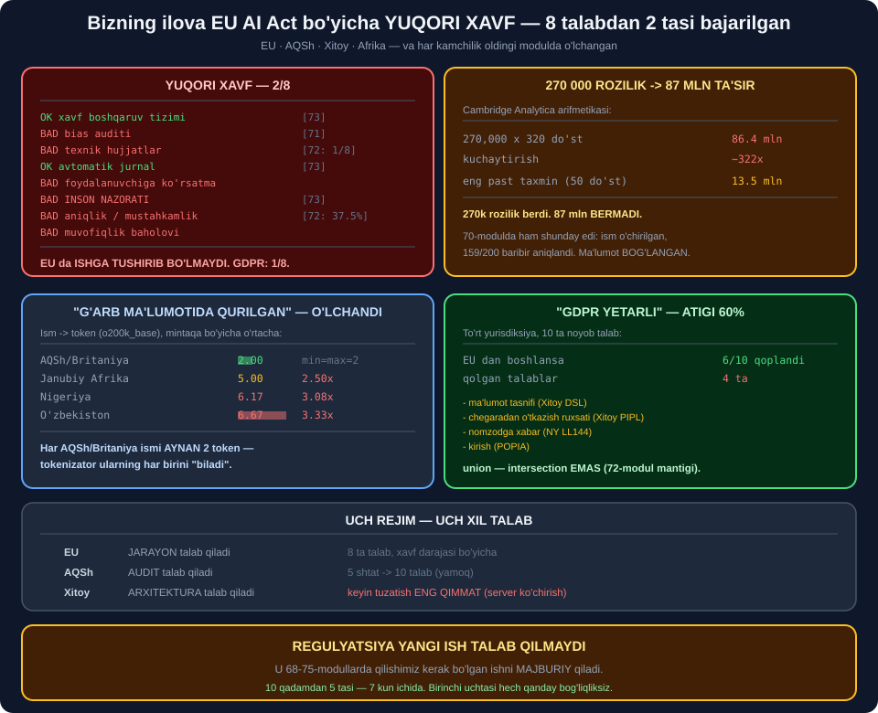

# 📦 76-modul. Ma'lumot va AI regulyatsiyasi asoslari

> ## ⭐⭐⭐ **KURSNING OXIRGI MODULI — VA U OLDINGI SAKKIZTASINI TEKSHIRADI.**
>
> ## 💥 **BIZNING ILOVA — EU AI Act BO'YICHA YUQORI XAVF. 8 TA TALABDAN 2 TASI BAJARILGAN.**
>
> ## 💥 **"GDPR NI BAJARSAM YETARLI" — ATIGI 60%.**



---

## 📚 Darslar

| # | Dars | Nima o'rganasiz |
|---|---|---|
| 1 | [Global manzara](01-Global-Overview.md) ⭐⭐⭐ | ## 💥 **GDPR — 60% qoplaydi** |
| 2 | [EI: GDPR va AI Act](02-EU-GDPR-and-AI-Act.md) ⭐⭐⭐⭐⭐ | ## 💥 **Yuqori xavf: 2/8** |
| 3 | [AQSh: shtatlar](03-United-States.md) ⭐⭐⭐ | ## 💥 **5 shtat → 10 talab** |
| 4 | [Osiyo-Tinch okeani](04-Asia-Pacific.md) ⭐⭐⭐ | ## **Ma'lumot tasnifi** · arxitektura |
| 5 | [Afrika](05-Africa.md) ⭐⭐⭐⭐ | ## 💥 **Ismlar: `2.00` vs `6.67` token** |

---

## 📝 Amaliyot

| | |
|---|---|
| 📝 [**7 ta mashq**](MASHQLAR.md) | 🟢 Oson · 🟡 O'rta · 🔴 Qiyin |

---

## 💥💥💥 Bosh topilma: **regulyatsiya yangi ish talab qilmaydi**

EU AI Act tasniflagichini yozdik va **o'z ilovamizni** o'tkazdik.

```
  BIZNING ilova (yollash)  ->  YUQORI XAVF  (8 ta talab)
```

Sakkizta talabni **68–75-modullardagi o'lchovlarimizga** solishtirdik:

```
  OK  xavf boshqaruv tizimi                   [73-modul: reyestr]
  BAD ma'lumot boshqaruvi (bias tekshiruvi)   [71-modul: qilinmagan]
  BAD texnik hujjatlar                        [72-modul: karta 1/8]
  OK  avtomatik jurnal (logging)              [73-modul]
  BAD foydalanuvchiga aniq ko'rsatma
  BAD INSON NAZORATI                          [73-modul: quvvat yetmadi]
  BAD aniqlik, mustahkamlik, kiberxavfsizlik  [72-modul: 37.5% nomuvofiq]
  BAD muvofiqlik baholovi

  2/8 = 25%   ->  EU da ISHGA TUSHIRIB BO'LMAYDI
```

> ## 🔑 **HAR `BAD` — OLDINGI MODULDA ## ⭐ ALLAQACHON O'LCHANGAN KAMCHILIK.**

> ## 🏆🏆 **YA'NI AI Act ALOHIDA ISH TALAB QILMAYDI —** ## u ## 💡 **68–75-modullarda qilishimiz kerak bo'lgan ishni** ## 💥 **MAJBURIY** qiladi.

> ## 💥 **GDPR ESA — 1/8,** ## va yagona `OK` ## ⚠️ **eng osoni** *(maqsadni cheklash)*.

---

## 💥💥 Ikkinchi topilma: *"GDPR yetarli"* — **60%**

```
  Jami noyob talab: 10

   boshlansa   qoplandi   qolgan
          EU          6        4
          CN          4        6
          ZA          3        7
          NY          2        8
```

> ## ✅ **EU — ENG SAMARALI BOSHLANISH.** ## ## 💥 **LEKIN 4 TA TALAB QOLADI:**

| Qolgan talab | Manba |
|---|---|
| ## **Ma'lumot tasnifi** | Xitoy DSL |
| ## **Chegaradan o'tkazish ruxsati** | Xitoy PIPL |
| Nomzodga xabar | NY LL144 |
| Kirish | POPIA |

> ## 🔑 **VA IKKITASI — XITOYNIKI,** ## ular ## ⭐ **arxitekturaga** tegadi *(server joylashuvi)*. ## ## 💥 **Keyin tuzatish — eng qimmat.**

> ## 💡 **BIRLASHTIRISH — `union`, `intersection` EMAS.** ## ## 🏆 Bu — 72-moduldagi **litsenziya aralashmasi** mantiqi: ## ⭐ **eng cheklovchi shart g'olib**.

---

## 💥 Uchinchi topilma: **87 mln qanday chiqadi**

```
   so'rovnoma to'ldirgan   o'rtacha do'st      jami qamrov
                 270,000              320       86,400,000  <-- ~87 mln
```

> ## 💥💥 **270 000 ODAM ROZILIK BERDI. ## 87 MLN ODAM BERMADI.**
>
> ## ## 🔑 Kuchaytirish koeffitsienti — ## ⭐ **~322x**.

> ## 🏆 **VA ENG KICHIK TAXMINDA HAM** *(50 do'st)* — ## 💥 **13.5 mln odam**.

### 💡 Bu — kitobdagi takrorlanadigan naqsh

| Modul | Topilma |
|---|---|
| 70-modul | 💥 Ism o'chirilgan — **159/200 aniqlandi** |
| ## **76-modul** | ## 💥 **270k rozilik — 87 mln ta'sir** |

> ## 🔑 **IKKALASI HAM: ## ⭐ MA'LUMOT YOLG'IZ TURMAYDI.**

---

## 💥 To'rtinchi topilma: *"G'arb ma'lumotida qurilgan"* — **o'lchandi**

Kursning eng o'lchanadigan da'vosi. Beshta mintaqadan ismlar:

```
  mintaqa           o'rtacha token   min   max   nisbat
  AQSh/Britaniya              2.00     2     2     1.00x
  O'zbekiston                 6.67     5    10     3.33x
  Nigeriya                    6.17     5     8     3.08x
  Keniya                      5.17     4     6     2.58x
  Janubiy Afrika              5.00     5     5     2.50x
```

> ## 💥💥💥 **`min = max = 2`.** ## ## ⭐ AQSh/Britaniya ismlarining ## 🔑 **HAMMASI aynan ikki token** — ## tokenizator ularning ## 💡 **har birini "biladi"**.

```
  10 token  Shahnoza Yo'ldosheva
   2 token  John Smith
```

### 🏆 Oltita mustaqil o'lchov — **bir xil yo'nalishda**

```
  o'lchov                                     G'arb           boshqa
  Idioma testi (71-modul)             inglizcha 3/5    o'zbekcha 0/5
  Token narxi, jumla (74-modul)               1.00x            1.79x
  Token narxi, so'z (75-modul)                1.00x            2.14x
  Kontekst oynasi (74-modul)              571 savol        320 savol
  Tokenizator yangilanishi (74)         ruscha -54%   o'zbekcha -19%
  Ism narxi (bu dars)                     AQSh 2.00    Nigeriya 6.17
```

> ## ⚠️ **HALOL CHEKLOV:** ## biz **tokenlashni** o'lchadik, ## 💥 **yollash qarorini emas**. ## ## 🔑 Bu — **bilvosita** dalil.

> ## 💡 **VA BESHINCHI QATOR ENG ACHINARLISI:** ## tokenizator **yangilanganda** ham ## ⭐ **yaxshilanish allaqachon ## yaxshi ta'minlanganlarga** tegdi.

---

## 📊 Modulda o'lchangan hamma narsa

| O'lchov | Natija |
|---|---|
| ## **Cambridge Analytica arifmetikasi** | ## 💥 **270k × 320 = 86.4 mln** |
| Kuchaytirish koeffitsienti | 💥 **~322x** |
| Eng past taxminda | 💥 13.5 mln |
| ## **Bizning ilova (AI Act)** | ## 💥 **YUQORI XAVF** |
| ## **AI Act talablari** | ## 💥 **2/8 = 25%** |
| ## **GDPR talablari** | ## 💥 **1/8 = 12%** |
| GDPR: eng qimmat 2 talab | 💥 Butun ishning **46%** i |
| ## **AQSh: 1 shtat** | 4 ta talab |
| ## **AQSh: 5 shtat** | ## 💥 **10 ta talab (2.5x)** |
| Faqat bitta shtatda | ⚠️ 7/10 talab |
| ## **4 yurisdiksiya jami** | ## **10 ta talab** |
| ## **EU dan boshlansa** | ## 💥 **60% qoplanadi** |
| NY LL144 talablari | 💥 **3/3 bajarilmagan** |
| ## **Ismlar: AQSh/Britaniya** | ## ⭐ **2.00 token** *(min=max)* |
| ## **Ismlar: O'zbekiston** | ## 💥 **6.67 (3.33x)** |
| Ismlar: Nigeriya | 💥 6.17 *(3.08x)* |
| 50 000 ism narxi farqi | ⚠️ `$0.56` — **ahamiyatsiz** |
| ## **Muvofiqlik yo'l xaritasi** | ## 🏆 **5/10 qadam — 7 kun** |

---

## ✅ Kurs to'g'ri aytgan narsalar

| Da'vo | Tekshiruv |
|---|---|
| Uchta xil yondashuv | ## ✅ **Jarayon / audit / arxitektura** |
| GDPR chegaradan tashqari qo'llanadi | ## ✅ **"Foydalanuvchilarim qayerda?"** |
| ## **Cambridge Analytica → GDPR** | ## 💥 **270k → 87 mln** |
| AI Act — xavgga asoslangan | ## ✅ **Tasniflagich yozildi** |
| Yollash — yuqori xavf | ## 💥 **Bizning ilova: 2/8** |
| ## **AQSh — "yamoq"** | ## 💥 **5 shtat → 10 talab** |
| NY: bias auditi majburiy | ## 💥 **3/3 bajarilmagan** |
| Xitoy: ma'lumot tasnifi | ## ✅ **EU da yo'q talab** |
| ## **"G'arb ma'lumotida qurilgan"** | ## 💥💥 **2.00 vs 6.67 token** |
| Ijtimoiy ball — qadriyat masalasi | ## ✅ **Kurs ikkala tomonni beradi** |

---

## ⚠️ Kursda yetishmagan narsalar

| Yetishmaydi | Nega muhim |
|---|---|
| ## **"GDPR yetarli" xatosi** | ## 💥💥 **Atigi 60%** |
| `87 mln` arifmetikasi | 💥 ~322x kuchayish |
| ## **AI Act ni O'ZINGIZGA qo'llash** | ## 🏆 **2/8** |
| Shaffoflik majburiyati *(4-toifa)* | ⭐ Kurs 3 tasini sanaydi |
| ## **"Muvofiq, lekin BO'SH" audit** | ## 💥 **69-modul: sezgirlik nazorati** |
| Talablarni `union` qilish | ⭐ 72-modul mantiqi |
| ## **O'chirish huquqi — modeldan** | ## 💥 **Deyarli imkonsiz** |
| Yo'l xaritasi va tartib | 🏆 5/10 qadam — 7 kun |

---

## 🚀 Tez boshlash — **muvofiqlik yo'l xaritasi**

```python
QADAMLAR = [
    ("Foydalanuvchi mamlakatlarini ro'yxatga olish", 1, None),
    ("Talablar birlashmasini hisoblash",             1, "1-qadam"),
    ("AI Act toifasini aniqlash",                    1, None),
    ("Ma'lumot tasnifi (DSL)",                       2, "70-modul"),
    ("Model karta yozish",                           2, "72-modul"),
    # --- shu yergacha: 7 kun, hech qanday og'ir bog'liqliksiz ---
    ("Qaytarish yo'li",                              3, "73-modul"),
    ("CI/CD chegaralari",                            3, "72-modul"),
    ("Bias auditi + sezgirlik nazorati",             5, "69-71-modul"),
    ("Inson nazorati jarayoni",                      5, "73-modul"),
    ("Saqlash muddati + o'chirish",                  5, "70-modul"),
]
```

> ## 🏆🏆 **BIRINCHI BESHTASI — 7 KUN.**
>
> ## ## ⭐ Va ular sizni ## 💡 **"muvofiq emasmiz"** dan ## 🔑 **"nima yetishmayotganini bilamiz"** ga o'tkazadi.

> ## ⚠️ **KUNLAR — MENING BAHOM,** ## jamoa va tizimga qarab keskin farq qiladi. ## ## ⭐ Muhimi — **tartib**, aniq son emas.

---

## 🔗 Bog'liq modullar

| Modul | Bog'liqlik |
|---|---|
| [69. Prinsiplar](../69-Core-Principles-of-AI-Ethics/README.md) | ## ⭐ **Sezgirlik nazorati** |
| [70. Ma'lumot to'plash](../70-Ethical-Data-Collection/README.md) | ## 🏆 **Yig'maslik — o'chirishdan arzon** |
| [72. Joylashtirish](../72-Ethical-AI-Deployment/README.md) | ⭐ Model karta, CI/CD |
| [73. Biznes uchun](../73-Ethical-AI-for-Businesses/README.md) | ## 🏆 **Xavf reyestri, qaytarish yo'li** |

---

🏠 [Kurs boshiga](../README.md) · 📝 [Mashqlar](MASHQLAR.md)
